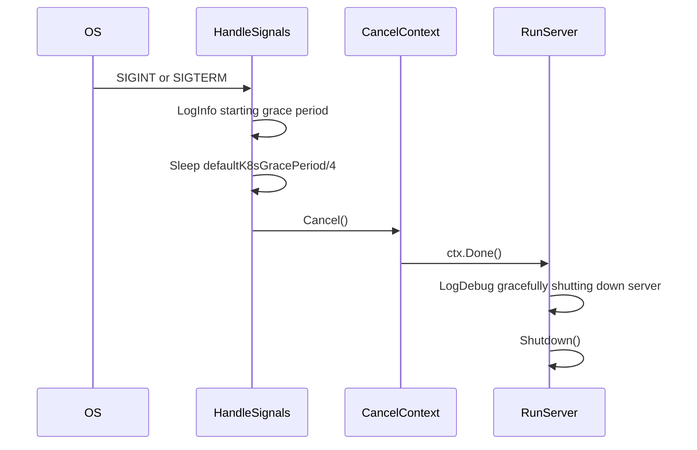

# Pull Request #2030: RHINENG-21760: add additional debug logs for shutdown

**Author**: @Dugowitch
**Created**: January 27, 2026 at 05:06 PM UTC
**Status**: Merged
**Labels**: None
**Base**: `master` ← **Head**: `RHINENG-21760`

## Description

## Secure Coding Practices Checklist GitHub Link
- https://github.com/RedHatInsights/secure-coding-checklist

## Secure Coding Checklist
- [x] Input Validation
- [x] Output Encoding
- [x] Authentication and Password Management
- [x] Session Management
- [x] Access Control
- [x] Cryptographic Practices
- [x] Error Handling and Logging
- [x] Data Protection
- [x] Communication Security
- [x] System Configuration
- [x] Database Security
- [x] File Management
- [x] Memory Management
- [x] General Coding Practices

## Summary by Sourcery

Improve graceful shutdown behavior and observability for the HTTP server and signal handling.

Enhancements:
- Add a configurable grace-period delay before cancelling the application context on SIGINT/SIGTERM to better align with Kubernetes shutdown expectations.
- Log a debug message when the HTTP server begins graceful shutdown to improve shutdown traceability.

Tests:
- Update server shutdown tests to assert the additional debug log and adjusted log ordering during graceful shutdown.

---

## Discussion

### Comment by @jira-linking on January 27, 2026 at 05:06 PM UTC

Referenced Jiras:
https://issues.redhat.com/browse/RHINENG-21760


### Comment by @sourcery-ai on January 27, 2026 at 05:07 PM UTC

<!-- Generated by sourcery-ai[bot]: start review_guide -->

<details>
<summary>Reviewer's guide (collapsed on small PRs)</summary>

## Reviewer's Guide

Adds additional observability around application shutdown by logging received termination signals and graceful HTTP server shutdown, and updates tests accordingly.

#### Sequence diagram for enhanced shutdown logging



### File-Level Changes

| Change | Details | Files |
| ------ | ------- | ----- |
| Improve signal handling observability and introduce a short grace period before context cancellation. | <ul><li>Wrap SIGINT/SIGTERM handling in a goroutine that captures the received signal value.</li><li>Log an informational message indicating the start of a grace period and include the specific signal name.</li><li>Sleep for a fraction of the default Kubernetes termination grace period before cancelling the application context.</li><li>Log completion of signal handling after context cancellation.</li></ul> | `base/base.go` |
| Enhance HTTP server shutdown logging when the application context is cancelled. | <ul><li>In the server goroutine, log a debug message just before invoking http.Server.Shutdown when the context is done.</li><li>Keep existing error logging for shutdown failures unchanged.</li></ul> | `base/utils/gin.go` |
| Adjust server tests to assert the new graceful shutdown logging behavior. | <ul><li>Increase the expected number of captured log entries in the RunServer test from one to two.</li><li>Update assertions to validate the order and content of the new graceful shutdown debug log followed by the existing successful close log.</li><li>Tidy imports to satisfy gofmt/goimports ordering.</li></ul> | `base/utils/gin_test.go` |

</details>

---

<details>
<summary>Tips and commands</summary>

#### Interacting with Sourcery

- **Trigger a new review:** Comment `@sourcery-ai review` on the pull request.
- **Continue discussions:** Reply directly to Sourcery's review comments.
- **Generate a GitHub issue from a review comment:** Ask Sourcery to create an
  issue from a review comment by replying to it. You can also reply to a
  review comment with `@sourcery-ai issue` to create an issue from it.
- **Generate a pull request title:** Write `@sourcery-ai` anywhere in the pull
  request title to generate a title at any time. You can also comment
  `@sourcery-ai title` on the pull request to (re-)generate the title at any time.
- **Generate a pull request summary:** Write `@sourcery-ai summary` anywhere in
  the pull request body to generate a PR summary at any time exactly where you
  want it. You can also comment `@sourcery-ai summary` on the pull request to
  (re-)generate the summary at any time.
- **Generate reviewer's guide:** Comment `@sourcery-ai guide` on the pull
  request to (re-)generate the reviewer's guide at any time.
- **Resolve all Sourcery comments:** Comment `@sourcery-ai resolve` on the
  pull request to resolve all Sourcery comments. Useful if you've already
  addressed all the comments and don't want to see them anymore.
- **Dismiss all Sourcery reviews:** Comment `@sourcery-ai dismiss` on the pull
  request to dismiss all existing Sourcery reviews. Especially useful if you
  want to start fresh with a new review - don't forget to comment
  `@sourcery-ai review` to trigger a new review!

#### Customizing Your Experience

Access your [dashboard](https://app.sourcery.ai) to:
- Enable or disable review features such as the Sourcery-generated pull request
  summary, the reviewer's guide, and others.
- Change the review language.
- Add, remove or edit custom review instructions.
- Adjust other review settings.

#### Getting Help

- [Contact our support team](mailto:support@sourcery.ai) for questions or feedback.
- Visit our [documentation](https://docs.sourcery.ai) for detailed guides and information.
- Keep in touch with the Sourcery team by following us on [X/Twitter](https://x.com/SourceryAI), [LinkedIn](https://www.linkedin.com/company/sourcery-ai/) or [GitHub](https://github.com/sourcery-ai).

</details>

<!-- Generated by sourcery-ai[bot]: end review_guide -->

### Comment by @codecov-commenter on January 28, 2026 at 08:47 AM UTC

## [Codecov](https://app.codecov.io/gh/RedHatInsights/patchman-engine/pull/2030?dropdown=coverage&src=pr&el=h1&utm_medium=referral&utm_source=github&utm_content=comment&utm_campaign=pr+comments&utm_term=RedHatInsights) Report
:x: Patch coverage is `25.00000%` with `3 lines` in your changes missing coverage. Please review.
:white_check_mark: Project coverage is 59.27%. Comparing base ([`e9178c5`](https://app.codecov.io/gh/RedHatInsights/patchman-engine/commit/e9178c5f0d740c713d835a55c85a283b67ffcd43?dropdown=coverage&el=desc&utm_medium=referral&utm_source=github&utm_content=comment&utm_campaign=pr+comments&utm_term=RedHatInsights)) to head ([`fb2b112`](https://app.codecov.io/gh/RedHatInsights/patchman-engine/commit/fb2b112ffab3df8f8f81c48df751af94c76bda2a?dropdown=coverage&el=desc&utm_medium=referral&utm_source=github&utm_content=comment&utm_campaign=pr+comments&utm_term=RedHatInsights)).
:warning: Report is 22 commits behind head on master.

| [Files with missing lines](https://app.codecov.io/gh/RedHatInsights/patchman-engine/pull/2030?dropdown=coverage&src=pr&el=tree&utm_medium=referral&utm_source=github&utm_content=comment&utm_campaign=pr+comments&utm_term=RedHatInsights) | Patch % | Lines |
|---|---|---|
| [base/base.go](https://app.codecov.io/gh/RedHatInsights/patchman-engine/pull/2030?src=pr&el=tree&filepath=base%2Fbase.go&utm_medium=referral&utm_source=github&utm_content=comment&utm_campaign=pr+comments&utm_term=RedHatInsights#diff-YmFzZS9iYXNlLmdv) | 0.00% | [3 Missing :warning: ](https://app.codecov.io/gh/RedHatInsights/patchman-engine/pull/2030?src=pr&el=tree&utm_medium=referral&utm_source=github&utm_content=comment&utm_campaign=pr+comments&utm_term=RedHatInsights) |

<details><summary>Additional details and impacted files</summary>


```diff
@@            Coverage Diff             @@
##           master    #2030      +/-   ##
==========================================
+ Coverage   59.18%   59.27%   +0.08%     
==========================================
  Files         133      134       +1     
  Lines        8599     8618      +19     
==========================================
+ Hits         5089     5108      +19     
  Misses       2967     2967              
  Partials      543      543              
```

| [Flag](https://app.codecov.io/gh/RedHatInsights/patchman-engine/pull/2030/flags?src=pr&el=flags&utm_medium=referral&utm_source=github&utm_content=comment&utm_campaign=pr+comments&utm_term=RedHatInsights) | Coverage Δ | |
|---|---|---|
| [unittests](https://app.codecov.io/gh/RedHatInsights/patchman-engine/pull/2030/flags?src=pr&el=flag&utm_medium=referral&utm_source=github&utm_content=comment&utm_campaign=pr+comments&utm_term=RedHatInsights) | `59.27% <25.00%> (+0.08%)` | :arrow_up: |

Flags with carried forward coverage won't be shown. [Click here](https://docs.codecov.io/docs/carryforward-flags?utm_medium=referral&utm_source=github&utm_content=comment&utm_campaign=pr+comments&utm_term=RedHatInsights#carryforward-flags-in-the-pull-request-comment) to find out more.
</details>

[:umbrella: View full report in Codecov by Sentry](https://app.codecov.io/gh/RedHatInsights/patchman-engine/pull/2030?dropdown=coverage&src=pr&el=continue&utm_medium=referral&utm_source=github&utm_content=comment&utm_campaign=pr+comments&utm_term=RedHatInsights).   
:loudspeaker: Have feedback on the report? [Share it here](https://about.codecov.io/codecov-pr-comment-feedback/?utm_medium=referral&utm_source=github&utm_content=comment&utm_campaign=pr+comments&utm_term=RedHatInsights).
<details><summary> :rocket: New features to boost your workflow: </summary>

- :snowflake: [Test Analytics](https://docs.codecov.com/docs/test-analytics): Detect flaky tests, report on failures, and find test suite problems.
</details>

### Comment by @Dugowitch on January 29, 2026 at 09:35 AM UTC

/retest

### Comment by @MichaelMraka on January 30, 2026 at 10:24 AM UTC

/retest

---

## Reviews

### Review by @sourcery-ai - Commented on January 27, 2026 at 05:08 PM UTC

Hey - I've left some high level feedback:

- In `HandleSignals`, consider logging the actual signal value (e.g., using the value read from the channel) instead of a generic `SIGTERM/SIGINT` message to make it clearer which signal triggered shutdown.
- In `RunServer`, it may be useful to include the server address/port in the "gracefully shutting down server" log message to aid debugging when multiple servers are running.

<details>
<summary>Prompt for AI Agents</summary>

~~~markdown
Please address the comments from this code review:

## Overall Comments
- In `HandleSignals`, consider logging the actual signal value (e.g., using the value read from the channel) instead of a generic `SIGTERM/SIGINT` message to make it clearer which signal triggered shutdown.
- In `RunServer`, it may be useful to include the server address/port in the "gracefully shutting down server" log message to aid debugging when multiple servers are running.
~~~

</details>

***

<details>
<summary>Sourcery is free for open source - if you like our reviews please consider sharing them ✨</summary>

- [X](https://twitter.com/intent/tweet?text=I%20just%20got%20an%20instant%20code%20review%20from%20%40SourceryAI%2C%20and%20it%20was%20brilliant%21%20It%27s%20free%20for%20open%20source%20and%20has%20a%20free%20trial%20for%20private%20code.%20Check%20it%20out%20https%3A//sourcery.ai)
- [Mastodon](https://mastodon.social/share?text=I%20just%20got%20an%20instant%20code%20review%20from%20%40SourceryAI%2C%20and%20it%20was%20brilliant%21%20It%27s%20free%20for%20open%20source%20and%20has%20a%20free%20trial%20for%20private%20code.%20Check%20it%20out%20https%3A//sourcery.ai)
- [LinkedIn](https://www.linkedin.com/sharing/share-offsite/?url=https://sourcery.ai)
- [Facebook](https://www.facebook.com/sharer/sharer.php?u=https://sourcery.ai)

</details>

<sub>
Help me be more useful! Please click 👍 or 👎 on each comment and I'll use the feedback to improve your reviews.
</sub>

### Review by @sourcery-ai - Commented on January 28, 2026 at 05:06 PM UTC

Hey - I've found 1 issue, and left some high level feedback:

- The fixed `defaultK8sGracePeriod` and unconditional `time.Sleep(defaultK8sGracePeriod / 4)` in `HandleSignals` make shutdown latency rigid and potentially misaligned with actual Kubernetes `terminationGracePeriodSeconds`; consider making this duration configurable or derived from environment/config instead of hard-coded.
- Using `time.Sleep` in the signal-handling goroutine makes the pre-cancel delay non-interruptible (e.g., on a second signal); consider using a `time.Timer` or context with timeout so you can still react promptly to additional signals or early-exit conditions during the grace window.
- For the new signal and shutdown messages, consider using structured logging (fields for signal type and grace-period duration) rather than string concatenation to make log filtering and analysis easier in production.

<details>
<summary>Prompt for AI Agents</summary>

~~~markdown
Please address the comments from this code review:

## Overall Comments
- The fixed `defaultK8sGracePeriod` and unconditional `time.Sleep(defaultK8sGracePeriod / 4)` in `HandleSignals` make shutdown latency rigid and potentially misaligned with actual Kubernetes `terminationGracePeriodSeconds`; consider making this duration configurable or derived from environment/config instead of hard-coded.
- Using `time.Sleep` in the signal-handling goroutine makes the pre-cancel delay non-interruptible (e.g., on a second signal); consider using a `time.Timer` or context with timeout so you can still react promptly to additional signals or early-exit conditions during the grace window.
- For the new signal and shutdown messages, consider using structured logging (fields for signal type and grace-period duration) rather than string concatenation to make log filtering and analysis easier in production.

## Individual Comments

### Comment 1
<location> `base/base.go:30-32` </location>
<code_context>
 	signal.Notify(c, syscall.SIGINT, syscall.SIGTERM)
 	go func() {
-		<-c
+		sig := <-c
+		utils.LogInfo("starting grace period for " + sig.String())
+		time.Sleep(defaultK8sGracePeriod / 4)
 		CancelContext()
 		utils.LogInfo("SIGTERM/SIGINT handled")
</code_context>

<issue_to_address>
**issue (bug_risk):** Blocking sleep in signal handler delays context cancellation and may reduce actual shutdown time window.

Sleeping in the signal-handling goroutine means shutdown doesn’t start until `defaultK8sGracePeriod/4` has elapsed, reducing the time available for cleanup and delaying all logic tied to this context. Instead, consider calling `CancelContext()` immediately and moving any delay to a separate goroutine that only governs process exit, or make the sleep duration configurable (including zero) so it can be tuned to the actual grace period of the deployment environment.
</issue_to_address>
~~~

</details>

***

<details>
<summary>Sourcery is free for open source - if you like our reviews please consider sharing them ✨</summary>

- [X](https://twitter.com/intent/tweet?text=I%20just%20got%20an%20instant%20code%20review%20from%20%40SourceryAI%2C%20and%20it%20was%20brilliant%21%20It%27s%20free%20for%20open%20source%20and%20has%20a%20free%20trial%20for%20private%20code.%20Check%20it%20out%20https%3A//sourcery.ai)
- [Mastodon](https://mastodon.social/share?text=I%20just%20got%20an%20instant%20code%20review%20from%20%40SourceryAI%2C%20and%20it%20was%20brilliant%21%20It%27s%20free%20for%20open%20source%20and%20has%20a%20free%20trial%20for%20private%20code.%20Check%20it%20out%20https%3A//sourcery.ai)
- [LinkedIn](https://www.linkedin.com/sharing/share-offsite/?url=https://sourcery.ai)
- [Facebook](https://www.facebook.com/sharer/sharer.php?u=https://sourcery.ai)

</details>

<sub>
Help me be more useful! Please click 👍 or 👎 on each comment and I'll use the feedback to improve your reviews.
</sub>

---

*Archived from: https://github.com/RedHatInsights/patchman-engine/pull/2030*
