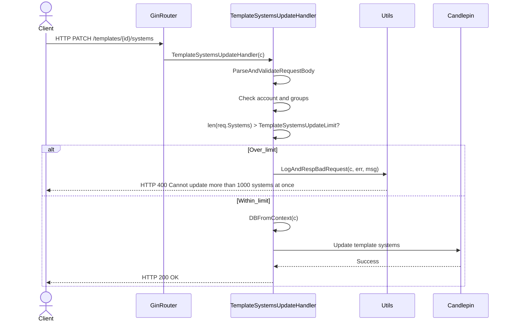
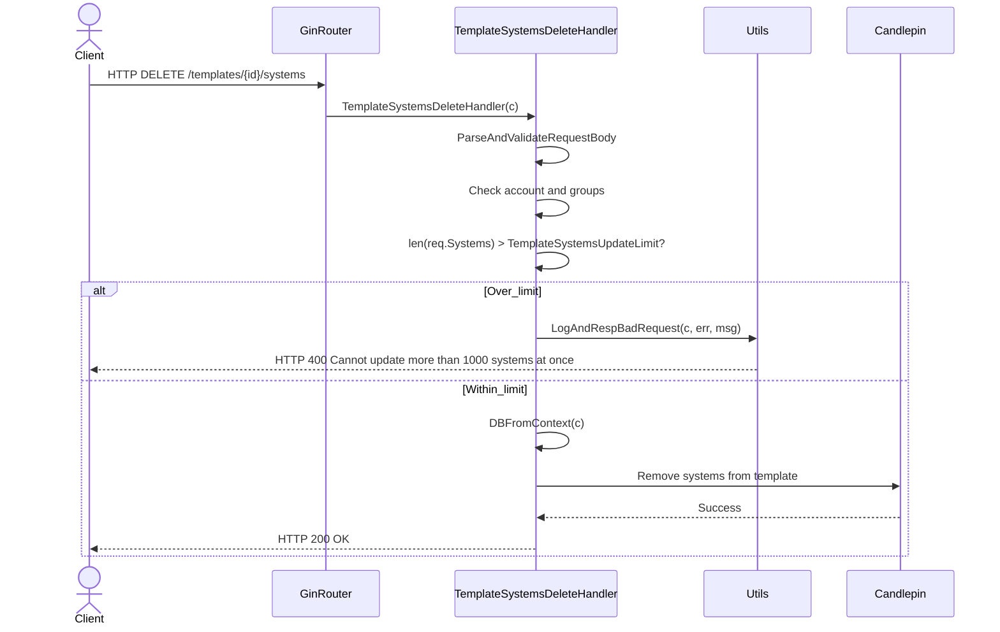
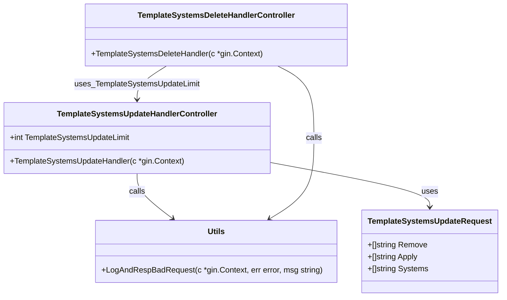

# Pull Request #2031: RHINENG-22863: limit systems to 1000 in update and delete template system apis

**Author**: @xbhouse
**Created**: January 27, 2026 at 08:14 PM UTC
**Status**: Merged
**Labels**: None
**Base**: `master` ← **Head**: `22863`

## Description

Updating or deleting a template from more than 1000 systems at one time results in a candlepin error, likely because we are hitting a defined [limit](https://github.com/candlepin/candlepin/blob/67d403edbcb1455f0772e16e656464ffe3a9ae7d/src/main/java/org/candlepin/config/ConfigProperties.java#L592):

```
{"@timestamp":"2026-01-24T17:00:14.896Z","err":"candlepin call https://admin.rhsm.stage.redhat.com/candlepin/owners/20007024/consumers/environments failed: HTTP call failed, status code: 400: Request failed: received non 2xx status code, status code: 400: candlepin error","level":"warning","message":"call to candlepin failed"}
```

This PR limits the number of requested systems to 1000 in the update and delete template system apis.

## Summary by Sourcery

Enforce a maximum number of systems that can be updated or removed from a template in a single API call to prevent downstream Candlepin errors.

Bug Fixes:
- Reject update and delete template system requests that include more systems than the supported limit to avoid Candlepin 400 errors.

Enhancements:
- Introduce a configurable constant for the maximum number of systems allowed per template systems update/delete request and validate incoming payloads against this limit.
- Add tests covering over-limit template systems update and delete scenarios and their corresponding error responses.

---

## Discussion

### Comment by @jira-linking on January 27, 2026 at 08:14 PM UTC

Referenced Jiras:
https://issues.redhat.com/browse/RHINENG-22863


### Comment by @sourcery-ai on January 27, 2026 at 08:14 PM UTC

<!-- Generated by sourcery-ai[bot]: start review_guide -->

## Reviewer's Guide

Adds a hard limit of 1000 systems per request to the template systems update and delete APIs and validates incoming payloads against this limit, returning a 400 error with a clear message when exceeded, along with tests for the new behavior.

#### Sequence diagram for template systems update with max-systems validation



#### Sequence diagram for template systems delete with max-systems validation



#### Updated class diagram for template systems controllers with max-systems limit



### File-Level Changes

| Change | Details | Files |
| ------ | ------- | ----- |
| Enforce a maximum systems-per-request limit for template system updates and deletions. | <ul><li>Introduce a shared TemplateSystemsUpdateLimit constant set to 1000.</li><li>In TemplateSystemsUpdateHandler, validate the incoming Systems slice length against TemplateSystemsUpdateLimit and short‑circuit with a 400 response when exceeded.</li><li>In TemplateSystemsDeleteHandler, add the same length check and 400 response behavior using utils.LogAndRespBadRequest.</li></ul> | `manager/controllers/template_systems_update.go`<br/>`manager/controllers/template_systems_delete.go` |
| Extend tests to cover over-limit scenarios for template system update and delete APIs and assert error responses. | <ul><li>Modify testTemplateSystemsDelete helper to return the response recorder so callers can inspect the response body.</li><li>Add TestTemplateSystemsDeleteTooManySystems to construct a template with TemplateSystemsUpdateLimit+1 systems, invoke delete, and assert a 400 with the expected error message.</li><li>Add TestUpdateTemplateTooManySystems to send a PUT with TemplateSystemsUpdateLimit+1 systems and assert a 400 response and error message.</li><li>Use uuid generation and sonic JSON marshaling in tests to create large system lists and request bodies.</li></ul> | `manager/controllers/template_systems_delete_test.go`<br/>`manager/controllers/template_systems_update_test.go` |

---

<details>
<summary>Tips and commands</summary>

#### Interacting with Sourcery

- **Trigger a new review:** Comment `@sourcery-ai review` on the pull request.
- **Continue discussions:** Reply directly to Sourcery's review comments.
- **Generate a GitHub issue from a review comment:** Ask Sourcery to create an
  issue from a review comment by replying to it. You can also reply to a
  review comment with `@sourcery-ai issue` to create an issue from it.
- **Generate a pull request title:** Write `@sourcery-ai` anywhere in the pull
  request title to generate a title at any time. You can also comment
  `@sourcery-ai title` on the pull request to (re-)generate the title at any time.
- **Generate a pull request summary:** Write `@sourcery-ai summary` anywhere in
  the pull request body to generate a PR summary at any time exactly where you
  want it. You can also comment `@sourcery-ai summary` on the pull request to
  (re-)generate the summary at any time.
- **Generate reviewer's guide:** Comment `@sourcery-ai guide` on the pull
  request to (re-)generate the reviewer's guide at any time.
- **Resolve all Sourcery comments:** Comment `@sourcery-ai resolve` on the
  pull request to resolve all Sourcery comments. Useful if you've already
  addressed all the comments and don't want to see them anymore.
- **Dismiss all Sourcery reviews:** Comment `@sourcery-ai dismiss` on the pull
  request to dismiss all existing Sourcery reviews. Especially useful if you
  want to start fresh with a new review - don't forget to comment
  `@sourcery-ai review` to trigger a new review!

#### Customizing Your Experience

Access your [dashboard](https://app.sourcery.ai) to:
- Enable or disable review features such as the Sourcery-generated pull request
  summary, the reviewer's guide, and others.
- Change the review language.
- Add, remove or edit custom review instructions.
- Adjust other review settings.

#### Getting Help

- [Contact our support team](mailto:support@sourcery.ai) for questions or feedback.
- Visit our [documentation](https://docs.sourcery.ai) for detailed guides and information.
- Keep in touch with the Sourcery team by following us on [X/Twitter](https://x.com/SourceryAI), [LinkedIn](https://www.linkedin.com/company/sourcery-ai/) or [GitHub](https://github.com/sourcery-ai).

</details>

<!-- Generated by sourcery-ai[bot]: end review_guide -->

### Comment by @codecov-commenter on January 27, 2026 at 08:32 PM UTC

## [Codecov](https://app.codecov.io/gh/RedHatInsights/patchman-engine/pull/2031?dropdown=coverage&src=pr&el=h1&utm_medium=referral&utm_source=github&utm_content=comment&utm_campaign=pr+comments&utm_term=RedHatInsights) Report
:white_check_mark: All modified and coverable lines are covered by tests.
:white_check_mark: Project coverage is 59.30%. Comparing base ([`50a0d9e`](https://app.codecov.io/gh/RedHatInsights/patchman-engine/commit/50a0d9e8732e4137f4f0c2689eec22fe7b3dfc46?dropdown=coverage&el=desc&utm_medium=referral&utm_source=github&utm_content=comment&utm_campaign=pr+comments&utm_term=RedHatInsights)) to head ([`95ef4b9`](https://app.codecov.io/gh/RedHatInsights/patchman-engine/commit/95ef4b9ea42febfe837a839b79fef93d18af2eee?dropdown=coverage&el=desc&utm_medium=referral&utm_source=github&utm_content=comment&utm_campaign=pr+comments&utm_term=RedHatInsights)).

<details><summary>Additional details and impacted files</summary>


```diff
@@            Coverage Diff             @@
##           master    #2031      +/-   ##
==========================================
+ Coverage   59.25%   59.30%   +0.05%     
==========================================
  Files         134      134              
  Lines        8615     8626      +11     
==========================================
+ Hits         5105     5116      +11     
  Misses       2967     2967              
  Partials      543      543              
```

| [Flag](https://app.codecov.io/gh/RedHatInsights/patchman-engine/pull/2031/flags?src=pr&el=flags&utm_medium=referral&utm_source=github&utm_content=comment&utm_campaign=pr+comments&utm_term=RedHatInsights) | Coverage Δ | |
|---|---|---|
| [unittests](https://app.codecov.io/gh/RedHatInsights/patchman-engine/pull/2031/flags?src=pr&el=flag&utm_medium=referral&utm_source=github&utm_content=comment&utm_campaign=pr+comments&utm_term=RedHatInsights) | `59.30% <100.00%> (+0.05%)` | :arrow_up: |

Flags with carried forward coverage won't be shown. [Click here](https://docs.codecov.io/docs/carryforward-flags?utm_medium=referral&utm_source=github&utm_content=comment&utm_campaign=pr+comments&utm_term=RedHatInsights#carryforward-flags-in-the-pull-request-comment) to find out more.
</details>

[:umbrella: View full report in Codecov by Sentry](https://app.codecov.io/gh/RedHatInsights/patchman-engine/pull/2031?dropdown=coverage&src=pr&el=continue&utm_medium=referral&utm_source=github&utm_content=comment&utm_campaign=pr+comments&utm_term=RedHatInsights).   
:loudspeaker: Have feedback on the report? [Share it here](https://about.codecov.io/codecov-pr-comment-feedback/?utm_medium=referral&utm_source=github&utm_content=comment&utm_campaign=pr+comments&utm_term=RedHatInsights).
<details><summary> :rocket: New features to boost your workflow: </summary>

- :snowflake: [Test Analytics](https://docs.codecov.com/docs/test-analytics): Detect flaky tests, report on failures, and find test suite problems.
</details>

---

## Reviews

### Review by @sourcery-ai - Commented on January 27, 2026 at 08:23 PM UTC

Hey - I've left some high level feedback:

- The over-limit check and error message are duplicated between TemplateSystemsUpdateHandler and TemplateSystemsDeleteHandler; consider extracting a small shared helper (or shared error message constant) to keep behavior and wording in sync.
- The error message uses "update" even in the delete handler and its tests; consider rephrasing to something operation-agnostic like "process" or using separate messages for update vs delete to avoid confusing API consumers.

<details>
<summary>Prompt for AI Agents</summary>

~~~markdown
Please address the comments from this code review:

## Overall Comments
- The over-limit check and error message are duplicated between TemplateSystemsUpdateHandler and TemplateSystemsDeleteHandler; consider extracting a small shared helper (or shared error message constant) to keep behavior and wording in sync.
- The error message uses "update" even in the delete handler and its tests; consider rephrasing to something operation-agnostic like "process" or using separate messages for update vs delete to avoid confusing API consumers.
~~~

</details>

***

<details>
<summary>Sourcery is free for open source - if you like our reviews please consider sharing them ✨</summary>

- [X](https://twitter.com/intent/tweet?text=I%20just%20got%20an%20instant%20code%20review%20from%20%40SourceryAI%2C%20and%20it%20was%20brilliant%21%20It%27s%20free%20for%20open%20source%20and%20has%20a%20free%20trial%20for%20private%20code.%20Check%20it%20out%20https%3A//sourcery.ai)
- [Mastodon](https://mastodon.social/share?text=I%20just%20got%20an%20instant%20code%20review%20from%20%40SourceryAI%2C%20and%20it%20was%20brilliant%21%20It%27s%20free%20for%20open%20source%20and%20has%20a%20free%20trial%20for%20private%20code.%20Check%20it%20out%20https%3A//sourcery.ai)
- [LinkedIn](https://www.linkedin.com/sharing/share-offsite/?url=https://sourcery.ai)
- [Facebook](https://www.facebook.com/sharer/sharer.php?u=https://sourcery.ai)

</details>

<sub>
Help me be more useful! Please click 👍 or 👎 on each comment and I'll use the feedback to improve your reviews.
</sub>

### Review by @Dugowitch - Approved on January 28, 2026 at 09:04 AM UTC

Looks good!

### Review by @MichaelMraka - Changes Requested on January 28, 2026 at 04:53 PM UTC

Thanks and congratulation on your first PR to Patch. ;)

### Review by @MichaelMraka - Commented on January 28, 2026 at 04:57 PM UTC

### Review by @xbhouse - Commented on January 28, 2026 at 05:59 PM UTC

### Review by @MichaelMraka - Approved on January 29, 2026 at 09:15 AM UTC

---

*Archived from: https://github.com/RedHatInsights/patchman-engine/pull/2031*
