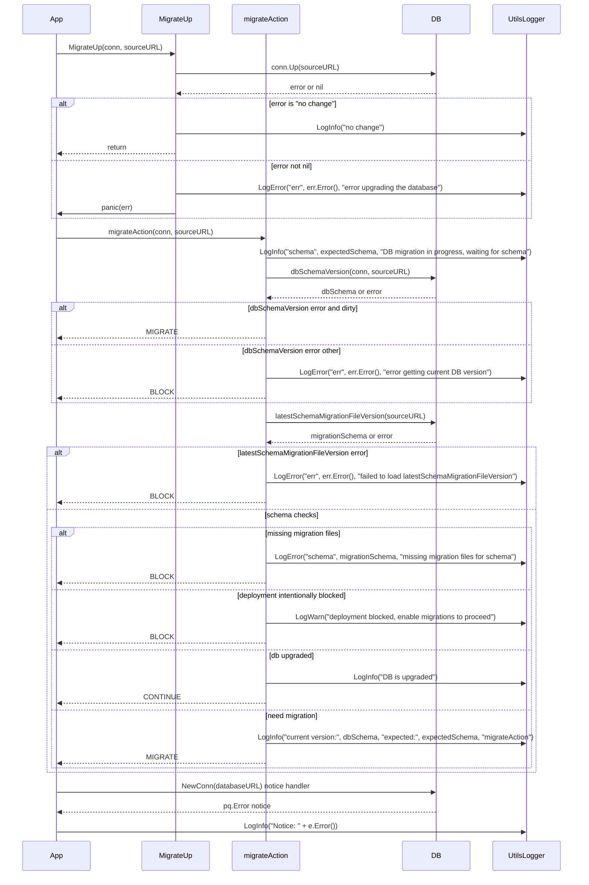

# Pull Request #2040: RHINENG-21214: fix migration, logging, and add notices

**Author**: @Dugowitch
**Created**: February 03, 2026 at 01:08 PM UTC
**Status**: Merged
**Labels**: None
**Base**: `master` ← **Head**: `tab-split`

## Description

## Secure Coding Practices Checklist GitHub Link
- https://github.com/RedHatInsights/secure-coding-checklist

## Secure Coding Checklist
- [x] Input Validation
- [x] Output Encoding
- [x] Authentication and Password Management
- [x] Session Management
- [x] Access Control
- [x] Cryptographic Practices
- [x] Error Handling and Logging
- [x] Data Protection
- [x] Communication Security
- [x] System Configuration
- [x] Database Security
- [x] File Management
- [x] Memory Management
- [x] General Coding Practices

## Summary by Sourcery

Align database migration logging with application logging utilities and add visibility into key steps of migration 142.

Bug Fixes:
- Route migration notices and errors through the shared logging utilities instead of direct stdout/stderr printing.

Enhancements:
- Add structured log messages around database schema version checks and migration decisions.
- Introduce PostgreSQL RAISE NOTICE statements throughout migration 142 to surface progress of creating and populating new tables, updating references, and completing the migration.

---

## Discussion

### Comment by @jira-linking on February 03, 2026 at 01:08 PM UTC

Referenced Jiras:
https://issues.redhat.com/browse/RHINENG-21214


### Comment by @sourcery-ai on February 03, 2026 at 01:08 PM UTC

<!-- Generated by sourcery-ai[bot]: start review_guide -->

## Reviewer's Guide

Standardizes database migration logging by routing notices and migration progress messages through the application logger instead of stdout/stderr, switches the migrate logger to use the Go log package, and enriches SQL migration 142 with explicit RAISE NOTICE statements that describe key steps of the migration lifecycle.

#### Sequence diagram for migration logging behavior in migrateAction and MigrateUp



#### Flow diagram for SQL migration 142 with RAISE NOTICE steps

```mermaid
flowchart TD
    start([Start migration 142])
    create_inventory[RAISE NOTICE Created system_inventory]
    load_inventory_data[Insert data into system_inventory]
    post_inventory_data_notice[RAISE NOTICE Data loaded into system_inventory]
    add_triggers_constraints_indexes[Create triggers, constraints, and indexes on system_inventory]
    triggers_constraints_indexes_notice[RAISE NOTICE Added triggers, constraints, and indexes to system_inventory]
    update_fkeys[Update foreign key references from system_platform to system_inventory]
    fkeys_notice[RAISE NOTICE Updated fkey references from system_platform to system_inventory]
    update_functions[Update functions to use system_inventory]
    functions_notice[RAISE NOTICE Updated functions to use system_inventory]
    create_system_patch[Create system_patch table and grants]
    system_patch_notice[RAISE NOTICE Created system_patch]
    load_system_patch_data[Insert data into system_patch from system_platform]
    system_patch_data_notice[RAISE NOTICE Data loaded into system_patch]
    finalize_permissions[Finalize grants on system_platform]
    end_notice[RAISE NOTICE Migration 142 end]
    end_node([End migration 142])

    start --> create_inventory --> load_inventory_data --> post_inventory_data_notice
    post_inventory_data_notice --> add_triggers_constraints_indexes --> triggers_constraints_indexes_notice
    triggers_constraints_indexes_notice --> update_fkeys --> fkeys_notice
    fkeys_notice --> update_functions --> functions_notice
    functions_notice --> create_system_patch --> system_patch_notice --> load_system_patch_data --> system_patch_data_notice
    system_patch_data_notice --> finalize_permissions --> end_notice --> end_node
```



### File-Level Changes

| Change | Details | Files |
| ------ | ------- | ----- |
| Route Go-side migration notices and status messages through the shared utils logger instead of stdout/stderr. | <ul><li>Replace pq notice handler output from fmt.Printf with utils.LogInfo using the error string</li><li>Update MigrateUp to log "no change" via utils.LogInfo and errors via utils.LogError before panicking</li><li>Change migrateAction to log schema checks, missing files, block conditions, and completion using utils.LogInfo/LogWarn/LogError instead of fmt</li></ul> | `database_admin/migrate.go` |
| Use the standard library log package for the migrate logger implementation. | <ul><li>Import the log package in migrate.go</li><li>Update logger.Printf to delegate to log.Printf instead of fmt.Printf</li></ul> | `database_admin/migrate.go` |
| Add in-database RAISE NOTICE statements to migration 142 to indicate progress through major migration phases. | <ul><li>Emit notices when system_inventory is created and when its data load completes</li><li>Emit notices after adding system_inventory triggers/constraints/indexes and updating foreign key references and dependent functions</li><li>Emit notices for creating and populating system_patch and at the end of migration 142</li></ul> | `database_admin/migrations/142_split_system_platform.up.sql` |

---

<details>
<summary>Tips and commands</summary>

#### Interacting with Sourcery

- **Trigger a new review:** Comment `@sourcery-ai review` on the pull request.
- **Continue discussions:** Reply directly to Sourcery's review comments.
- **Generate a GitHub issue from a review comment:** Ask Sourcery to create an
  issue from a review comment by replying to it. You can also reply to a
  review comment with `@sourcery-ai issue` to create an issue from it.
- **Generate a pull request title:** Write `@sourcery-ai` anywhere in the pull
  request title to generate a title at any time. You can also comment
  `@sourcery-ai title` on the pull request to (re-)generate the title at any time.
- **Generate a pull request summary:** Write `@sourcery-ai summary` anywhere in
  the pull request body to generate a PR summary at any time exactly where you
  want it. You can also comment `@sourcery-ai summary` on the pull request to
  (re-)generate the summary at any time.
- **Generate reviewer's guide:** Comment `@sourcery-ai guide` on the pull
  request to (re-)generate the reviewer's guide at any time.
- **Resolve all Sourcery comments:** Comment `@sourcery-ai resolve` on the
  pull request to resolve all Sourcery comments. Useful if you've already
  addressed all the comments and don't want to see them anymore.
- **Dismiss all Sourcery reviews:** Comment `@sourcery-ai dismiss` on the pull
  request to dismiss all existing Sourcery reviews. Especially useful if you
  want to start fresh with a new review - don't forget to comment
  `@sourcery-ai review` to trigger a new review!

#### Customizing Your Experience

Access your [dashboard](https://app.sourcery.ai) to:
- Enable or disable review features such as the Sourcery-generated pull request
  summary, the reviewer's guide, and others.
- Change the review language.
- Add, remove or edit custom review instructions.
- Adjust other review settings.

#### Getting Help

- [Contact our support team](mailto:support@sourcery.ai) for questions or feedback.
- Visit our [documentation](https://docs.sourcery.ai) for detailed guides and information.
- Keep in touch with the Sourcery team by following us on [X/Twitter](https://x.com/SourceryAI), [LinkedIn](https://www.linkedin.com/company/sourcery-ai/) or [GitHub](https://github.com/sourcery-ai).

</details>

<!-- Generated by sourcery-ai[bot]: end review_guide -->

### Comment by @codecov-commenter on February 03, 2026 at 02:05 PM UTC

## [Codecov](https://app.codecov.io/gh/RedHatInsights/patchman-engine/pull/2040?dropdown=coverage&src=pr&el=h1&utm_medium=referral&utm_source=github&utm_content=comment&utm_campaign=pr+comments&utm_term=RedHatInsights) Report
:white_check_mark: All modified and coverable lines are covered by tests.
:white_check_mark: Project coverage is 59.36%. Comparing base ([`e75e37d`](https://app.codecov.io/gh/RedHatInsights/patchman-engine/commit/e75e37d84b06865fd15f5786f05c19fa1f1dec63?dropdown=coverage&el=desc&utm_medium=referral&utm_source=github&utm_content=comment&utm_campaign=pr+comments&utm_term=RedHatInsights)) to head ([`a7a1360`](https://app.codecov.io/gh/RedHatInsights/patchman-engine/commit/a7a1360a272e5cb3dd10064f6fa86c2d2106473c?dropdown=coverage&el=desc&utm_medium=referral&utm_source=github&utm_content=comment&utm_campaign=pr+comments&utm_term=RedHatInsights)).

<details><summary>Additional details and impacted files</summary>


```diff
@@            Coverage Diff             @@
##           master    #2040      +/-   ##
==========================================
- Coverage   59.39%   59.36%   -0.03%     
==========================================
  Files         134      134              
  Lines        8678     8678              
==========================================
- Hits         5154     5152       -2     
- Misses       2977     2979       +2     
  Partials      547      547              
```

| [Flag](https://app.codecov.io/gh/RedHatInsights/patchman-engine/pull/2040/flags?src=pr&el=flags&utm_medium=referral&utm_source=github&utm_content=comment&utm_campaign=pr+comments&utm_term=RedHatInsights) | Coverage Δ | |
|---|---|---|
| [unittests](https://app.codecov.io/gh/RedHatInsights/patchman-engine/pull/2040/flags?src=pr&el=flag&utm_medium=referral&utm_source=github&utm_content=comment&utm_campaign=pr+comments&utm_term=RedHatInsights) | `59.36% <ø> (-0.03%)` | :arrow_down: |

Flags with carried forward coverage won't be shown. [Click here](https://docs.codecov.io/docs/carryforward-flags?utm_medium=referral&utm_source=github&utm_content=comment&utm_campaign=pr+comments&utm_term=RedHatInsights#carryforward-flags-in-the-pull-request-comment) to find out more.
</details>

[:umbrella: View full report in Codecov by Sentry](https://app.codecov.io/gh/RedHatInsights/patchman-engine/pull/2040?dropdown=coverage&src=pr&el=continue&utm_medium=referral&utm_source=github&utm_content=comment&utm_campaign=pr+comments&utm_term=RedHatInsights).   
:loudspeaker: Have feedback on the report? [Share it here](https://about.codecov.io/codecov-pr-comment-feedback/?utm_medium=referral&utm_source=github&utm_content=comment&utm_campaign=pr+comments&utm_term=RedHatInsights).
<details><summary> :rocket: New features to boost your workflow: </summary>

- :snowflake: [Test Analytics](https://docs.codecov.com/docs/test-analytics): Detect flaky tests, report on failures, and find test suite problems.
</details>

### Comment by @Dugowitch on February 03, 2026 at 02:22 PM UTC

/retest

---

## Reviews

### Review by @sourcery-ai - Commented on February 03, 2026 at 01:09 PM UTC

Hey - I've found 1 issue, and left some high level feedback:

- The new `utils.LogInfo`/`utils.LogError`/`utils.LogWarn` calls are used with varying argument order and mixed message/field placement (e.g., sometimes the human-readable message is last, sometimes split across arguments); consider standardizing on a single convention or helper (e.g., formatting the message first, then structured fields) to keep logs easier to parse and search.
- The addition of multiple `RAISE NOTICE` statements in `142_split_system_platform.up.sql` may significantly increase log noise during large migrations; consider consolidating them or using a consistent pattern (e.g., only at major checkpoints) so migration logs stay readable and performant.

<details>
<summary>Prompt for AI Agents</summary>

~~~markdown
Please address the comments from this code review:

## Overall Comments
- The new `utils.LogInfo`/`utils.LogError`/`utils.LogWarn` calls are used with varying argument order and mixed message/field placement (e.g., sometimes the human-readable message is last, sometimes split across arguments); consider standardizing on a single convention or helper (e.g., formatting the message first, then structured fields) to keep logs easier to parse and search.
- The addition of multiple `RAISE NOTICE` statements in `142_split_system_platform.up.sql` may significantly increase log noise during large migrations; consider consolidating them or using a consistent pattern (e.g., only at major checkpoints) so migration logs stay readable and performant.

## Individual Comments

### Comment 1
<location> `database_admin/migrations/142_split_system_platform.up.sql:58` </location>
<code_context>
 GRANT SELECT, USAGE ON SEQUENCE system_inventory_id_seq TO listener;
 GRANT SELECT, USAGE ON SEQUENCE system_inventory_id_seq TO vmaas_sync;

+RAISE NOTICE 'Created system_inventory';
+
 -- LOAD DATA
</code_context>

<issue_to_address>
**issue (bug_risk):** Top-level RAISE NOTICE statements may not be valid outside PL/pgSQL blocks.

In PostgreSQL, `RAISE NOTICE` is only valid inside PL/pgSQL (e.g., inside a function or `DO $$ BEGIN ... END $$;`). At the top level of a migration script it will cause a syntax error. If you need these messages, wrap them in a `DO` block (e.g., `DO $$ BEGIN RAISE NOTICE 'Created system_inventory'; END $$;`) or rely on the migration system’s existing logging instead.
</issue_to_address>
~~~

</details>

***

<details>
<summary>Sourcery is free for open source - if you like our reviews please consider sharing them ✨</summary>

- [X](https://twitter.com/intent/tweet?text=I%20just%20got%20an%20instant%20code%20review%20from%20%40SourceryAI%2C%20and%20it%20was%20brilliant%21%20It%27s%20free%20for%20open%20source%20and%20has%20a%20free%20trial%20for%20private%20code.%20Check%20it%20out%20https%3A//sourcery.ai)
- [Mastodon](https://mastodon.social/share?text=I%20just%20got%20an%20instant%20code%20review%20from%20%40SourceryAI%2C%20and%20it%20was%20brilliant%21%20It%27s%20free%20for%20open%20source%20and%20has%20a%20free%20trial%20for%20private%20code.%20Check%20it%20out%20https%3A//sourcery.ai)
- [LinkedIn](https://www.linkedin.com/sharing/share-offsite/?url=https://sourcery.ai)
- [Facebook](https://www.facebook.com/sharer/sharer.php?u=https://sourcery.ai)

</details>

<sub>
Help me be more useful! Please click 👍 or 👎 on each comment and I'll use the feedback to improve your reviews.
</sub>

---

*Archived from: https://github.com/RedHatInsights/patchman-engine/pull/2040*
