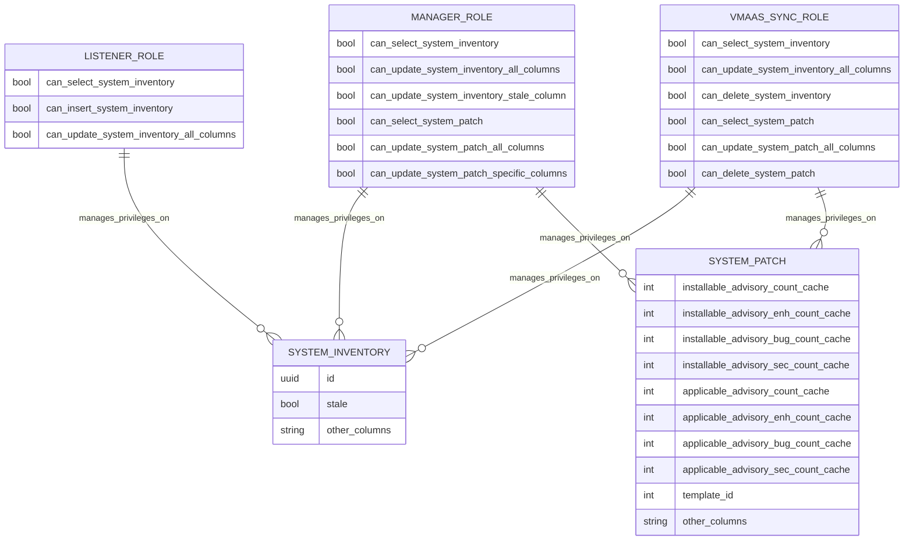

# Pull Request #2043: RHINENG-21214: hotfix manager privileges

**Author**: @Dugowitch
**Created**: February 06, 2026 at 10:33 AM UTC
**Status**: Merged
**Labels**: None
**Base**: `master` ← **Head**: `fix3`

## Description

## Secure Coding Practices Checklist GitHub Link
- https://github.com/RedHatInsights/secure-coding-checklist

## Secure Coding Checklist
- [x] Input Validation
- [x] Output Encoding
- [x] Authentication and Password Management
- [x] Session Management
- [x] Access Control
- [x] Cryptographic Practices
- [x] Error Handling and Logging
- [x] Data Protection
- [x] Communication Security
- [x] System Configuration
- [x] Database Security
- [x] File Management
- [x] Memory Management
- [x] General Coding Practices

## Summary by Sourcery

Adjust manager database privileges as a temporary hotfix to resolve system update issues while preserving a path to revert to more restrictive access.

Bug Fixes:
- Grant broader UPDATE privileges for the manager role on system_inventory and system_patch tables to fix permission-related failures when updating systems via the system_platform view.

Enhancements:
- Add reversible migration scripts to manage manager role privileges on system_inventory and system_patch tables and update the schema migration version.
- Document the temporary nature of the expanded manager privileges in the template systems update controller for future cleanup.

---

## Discussion

### Comment by @jira-linking on February 06, 2026 at 10:33 AM UTC

Referenced Jiras:
https://issues.redhat.com/browse/RHINENG-21214


### Comment by @sourcery-ai on February 06, 2026 at 10:33 AM UTC

<!-- Generated by sourcery-ai[bot]: start review_guide -->

## Reviewer's Guide

This PR temporarily broadens the database UPDATE privileges for the manager role on system_inventory and system_patch, wires that into the schema/migration system, and documents the temporary nature of the change near the affected controller logic.

#### Entity relationship diagram for manager role privileges on system tables



### File-Level Changes

| Change | Details | Files |
| ------ | ------- | ----- |
| Broaden manager role UPDATE privileges on system_inventory and system_patch as a temporary hotfix. | <ul><li>Bump schema_migrations seed value from 144 to 145 to reflect the new migration.</li><li>Grant manager full UPDATE on system_inventory in addition to the existing column-specific grant.</li><li>Grant manager full UPDATE on system_patch in addition to the existing column-specific grant.</li></ul> | `database_admin/schema/create_schema.sql` |
| Add reversible migration to grant/revoke the expanded manager privileges. | <ul><li>Create 145_update_manager_privileges.up.sql to grant full UPDATE on system_inventory and system_patch to the manager role.</li><li>Create 145_update_manager_privileges.down.sql to revoke full UPDATE and restore the previous column-specific privileges on system_inventory and system_patch.</li></ul> | `database_admin/migrations/145_update_manager_privileges.up.sql`<br/>`database_admin/migrations/145_update_manager_privileges.down.sql` |
| Document the temporary nature of the expanded privileges near the system platform update logic. | <ul><li>Add a TODO comment in the template systems update controller explaining that the broader manager privileges are temporary and pointing to migration 145 for the eventual rollback.</li></ul> | `manager/controllers/template_systems_update.go` |

---

<details>
<summary>Tips and commands</summary>

#### Interacting with Sourcery

- **Trigger a new review:** Comment `@sourcery-ai review` on the pull request.
- **Continue discussions:** Reply directly to Sourcery's review comments.
- **Generate a GitHub issue from a review comment:** Ask Sourcery to create an
  issue from a review comment by replying to it. You can also reply to a
  review comment with `@sourcery-ai issue` to create an issue from it.
- **Generate a pull request title:** Write `@sourcery-ai` anywhere in the pull
  request title to generate a title at any time. You can also comment
  `@sourcery-ai title` on the pull request to (re-)generate the title at any time.
- **Generate a pull request summary:** Write `@sourcery-ai summary` anywhere in
  the pull request body to generate a PR summary at any time exactly where you
  want it. You can also comment `@sourcery-ai summary` on the pull request to
  (re-)generate the summary at any time.
- **Generate reviewer's guide:** Comment `@sourcery-ai guide` on the pull
  request to (re-)generate the reviewer's guide at any time.
- **Resolve all Sourcery comments:** Comment `@sourcery-ai resolve` on the
  pull request to resolve all Sourcery comments. Useful if you've already
  addressed all the comments and don't want to see them anymore.
- **Dismiss all Sourcery reviews:** Comment `@sourcery-ai dismiss` on the pull
  request to dismiss all existing Sourcery reviews. Especially useful if you
  want to start fresh with a new review - don't forget to comment
  `@sourcery-ai review` to trigger a new review!

#### Customizing Your Experience

Access your [dashboard](https://app.sourcery.ai) to:
- Enable or disable review features such as the Sourcery-generated pull request
  summary, the reviewer's guide, and others.
- Change the review language.
- Add, remove or edit custom review instructions.
- Adjust other review settings.

#### Getting Help

- [Contact our support team](mailto:support@sourcery.ai) for questions or feedback.
- Visit our [documentation](https://docs.sourcery.ai) for detailed guides and information.
- Keep in touch with the Sourcery team by following us on [X/Twitter](https://x.com/SourceryAI), [LinkedIn](https://www.linkedin.com/company/sourcery-ai/) or [GitHub](https://github.com/sourcery-ai).

</details>

<!-- Generated by sourcery-ai[bot]: end review_guide -->

### Comment by @codecov-commenter on February 06, 2026 at 03:53 PM UTC

## [Codecov](https://app.codecov.io/gh/RedHatInsights/patchman-engine/pull/2043?dropdown=coverage&src=pr&el=h1&utm_medium=referral&utm_source=github&utm_content=comment&utm_campaign=pr+comments&utm_term=RedHatInsights) Report
:white_check_mark: All modified and coverable lines are covered by tests.
:white_check_mark: Project coverage is 59.39%. Comparing base ([`9783708`](https://app.codecov.io/gh/RedHatInsights/patchman-engine/commit/97837089756913646fd9d15cf1b244aeae52ad0e?dropdown=coverage&el=desc&utm_medium=referral&utm_source=github&utm_content=comment&utm_campaign=pr+comments&utm_term=RedHatInsights)) to head ([`ba40da7`](https://app.codecov.io/gh/RedHatInsights/patchman-engine/commit/ba40da72c3076f68e2b5d8d25ea0f0074149fd0c?dropdown=coverage&el=desc&utm_medium=referral&utm_source=github&utm_content=comment&utm_campaign=pr+comments&utm_term=RedHatInsights)).

<details><summary>Additional details and impacted files</summary>


```diff
@@           Coverage Diff           @@
##           master    #2043   +/-   ##
=======================================
  Coverage   59.39%   59.39%           
=======================================
  Files         134      134           
  Lines        8678     8678           
=======================================
  Hits         5154     5154           
  Misses       2977     2977           
  Partials      547      547           
```

| [Flag](https://app.codecov.io/gh/RedHatInsights/patchman-engine/pull/2043/flags?src=pr&el=flags&utm_medium=referral&utm_source=github&utm_content=comment&utm_campaign=pr+comments&utm_term=RedHatInsights) | Coverage Δ | |
|---|---|---|
| [unittests](https://app.codecov.io/gh/RedHatInsights/patchman-engine/pull/2043/flags?src=pr&el=flag&utm_medium=referral&utm_source=github&utm_content=comment&utm_campaign=pr+comments&utm_term=RedHatInsights) | `59.39% <ø> (ø)` | |

Flags with carried forward coverage won't be shown. [Click here](https://docs.codecov.io/docs/carryforward-flags?utm_medium=referral&utm_source=github&utm_content=comment&utm_campaign=pr+comments&utm_term=RedHatInsights#carryforward-flags-in-the-pull-request-comment) to find out more.
</details>

[:umbrella: View full report in Codecov by Sentry](https://app.codecov.io/gh/RedHatInsights/patchman-engine/pull/2043?dropdown=coverage&src=pr&el=continue&utm_medium=referral&utm_source=github&utm_content=comment&utm_campaign=pr+comments&utm_term=RedHatInsights).   
:loudspeaker: Have feedback on the report? [Share it here](https://about.codecov.io/codecov-pr-comment-feedback/?utm_medium=referral&utm_source=github&utm_content=comment&utm_campaign=pr+comments&utm_term=RedHatInsights).
<details><summary> :rocket: New features to boost your workflow: </summary>

- :snowflake: [Test Analytics](https://docs.codecov.com/docs/test-analytics): Detect flaky tests, report on failures, and find test suite problems.
</details>

---

## Reviews

### Review by @sourcery-ai - Commented on February 06, 2026 at 10:34 AM UTC

Hey - I've left some high level feedback:

- Consider adding a brief SQL comment in the 145_up/down migration files explaining that this is a temporary broadening of manager privileges tied to the SystemPlatform removal, so the context isn’t only captured in the Go TODO.
- You may want to wrap the REVOKE/GRANT statements in 145_update_manager_privileges.down.sql in an explicit transaction to avoid any transient period where manager has neither the broad nor column-specific UPDATE privileges if the migration is interrupted.

<details>
<summary>Prompt for AI Agents</summary>

~~~markdown
Please address the comments from this code review:

## Overall Comments
- Consider adding a brief SQL comment in the 145_up/down migration files explaining that this is a temporary broadening of manager privileges tied to the SystemPlatform removal, so the context isn’t only captured in the Go TODO.
- You may want to wrap the REVOKE/GRANT statements in 145_update_manager_privileges.down.sql in an explicit transaction to avoid any transient period where manager has neither the broad nor column-specific UPDATE privileges if the migration is interrupted.
~~~

</details>

***

<details>
<summary>Sourcery is free for open source - if you like our reviews please consider sharing them ✨</summary>

- [X](https://twitter.com/intent/tweet?text=I%20just%20got%20an%20instant%20code%20review%20from%20%40SourceryAI%2C%20and%20it%20was%20brilliant%21%20It%27s%20free%20for%20open%20source%20and%20has%20a%20free%20trial%20for%20private%20code.%20Check%20it%20out%20https%3A//sourcery.ai)
- [Mastodon](https://mastodon.social/share?text=I%20just%20got%20an%20instant%20code%20review%20from%20%40SourceryAI%2C%20and%20it%20was%20brilliant%21%20It%27s%20free%20for%20open%20source%20and%20has%20a%20free%20trial%20for%20private%20code.%20Check%20it%20out%20https%3A//sourcery.ai)
- [LinkedIn](https://www.linkedin.com/sharing/share-offsite/?url=https://sourcery.ai)
- [Facebook](https://www.facebook.com/sharer/sharer.php?u=https://sourcery.ai)

</details>

<sub>
Help me be more useful! Please click 👍 or 👎 on each comment and I'll use the feedback to improve your reviews.
</sub>

### Review by @sourcery-ai - Commented on February 09, 2026 at 12:35 PM UTC

Hey - I've left some high level feedback:

- In `create_schema.sql` you now have both a column-specific `GRANT ... UPDATE (stale)` and a full-table `GRANT ... UPDATE` for `system_inventory` (and similarly for `system_patch`); consider replacing or adjusting the existing GRANTs instead of adding overlapping ones to avoid confusion about the effective privileges.
- The comment on the new `GRANT SELECT, UPDATE ON system_inventory TO manager` line still mentions updating the `opt_out` column, but the GRANT now covers the entire table, which can be misleading; consider updating the comment to accurately describe the broader, temporary privilege scope.

<details>
<summary>Prompt for AI Agents</summary>

~~~markdown
Please address the comments from this code review:

## Overall Comments
- In `create_schema.sql` you now have both a column-specific `GRANT ... UPDATE (stale)` and a full-table `GRANT ... UPDATE` for `system_inventory` (and similarly for `system_patch`); consider replacing or adjusting the existing GRANTs instead of adding overlapping ones to avoid confusion about the effective privileges.
- The comment on the new `GRANT SELECT, UPDATE ON system_inventory TO manager` line still mentions updating the `opt_out` column, but the GRANT now covers the entire table, which can be misleading; consider updating the comment to accurately describe the broader, temporary privilege scope.
~~~

</details>

***

<details>
<summary>Sourcery is free for open source - if you like our reviews please consider sharing them ✨</summary>

- [X](https://twitter.com/intent/tweet?text=I%20just%20got%20an%20instant%20code%20review%20from%20%40SourceryAI%2C%20and%20it%20was%20brilliant%21%20It%27s%20free%20for%20open%20source%20and%20has%20a%20free%20trial%20for%20private%20code.%20Check%20it%20out%20https%3A//sourcery.ai)
- [Mastodon](https://mastodon.social/share?text=I%20just%20got%20an%20instant%20code%20review%20from%20%40SourceryAI%2C%20and%20it%20was%20brilliant%21%20It%27s%20free%20for%20open%20source%20and%20has%20a%20free%20trial%20for%20private%20code.%20Check%20it%20out%20https%3A//sourcery.ai)
- [LinkedIn](https://www.linkedin.com/sharing/share-offsite/?url=https://sourcery.ai)
- [Facebook](https://www.facebook.com/sharer/sharer.php?u=https://sourcery.ai)

</details>

<sub>
Help me be more useful! Please click 👍 or 👎 on each comment and I'll use the feedback to improve your reviews.
</sub>

### Review by @MichaelMraka - Approved on February 10, 2026 at 09:15 AM UTC

---

*Archived from: https://github.com/RedHatInsights/patchman-engine/pull/2043*
