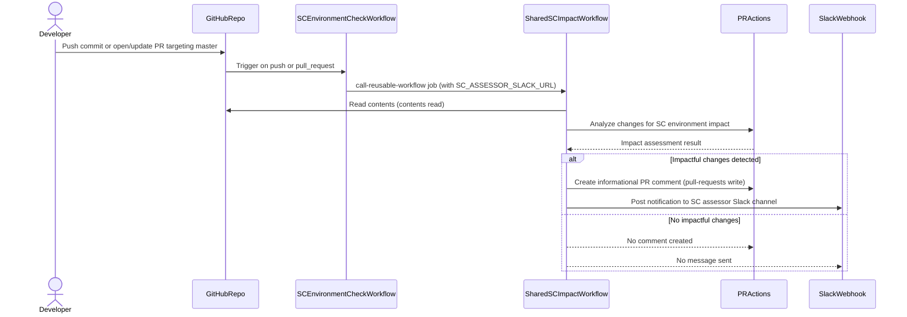

# Pull Request #2053: Add SC Environment Impact Workflow

**Author**: @SteveHNH
**Created**: February 11, 2026 at 04:06 PM UTC
**Status**: Merged
**Labels**: None
**Base**: `master` ← **Head**: `add-sc-impact-workflow`

## Description

Adding a workflow to check for impactful SC environment changes. This will drop a comment in PRs to notify the author of impactful changes and notify the rosa core team slack channel. This is non-blocking and informational to better prevent issues during release week for the security compliance environment.

HCMSEC-2787

## Secure Coding Practices Checklist GitHub Link
- https://github.com/RedHatInsights/secure-coding-checklist

## Secure Coding Checklist
- [x] Input Validation
- [x] Output Encoding
- [x] Authentication and Password Management
- [x] Session Management
- [x] Access Control
- [x] Cryptographic Practices
- [x] Error Handling and Logging
- [x] Data Protection
- [x] Communication Security
- [x] System Configuration
- [x] Database Security
- [x] File Management
- [x] Memory Management
- [x] General Coding Practices

## Summary by Sourcery

CI:
- Introduce a reusable GitHub Actions workflow that runs on master pushes and pull requests to check for impactful security compliance environment changes and notify maintainers via PR comments and Slack.

---

## Discussion

### Comment by @sourcery-ai on February 11, 2026 at 04:06 PM UTC

<!-- Generated by sourcery-ai[bot]: start review_guide -->

<details>
<summary>Reviewer's guide (collapsed on small PRs)</summary>

## Reviewer's Guide

Adds a new non-blocking GitHub Actions workflow that runs on pushes and pull requests to master, invoking a shared reusable workflow to detect security compliance environment-impacting changes and notify both the PR and the SC assessor Slack channel.

#### Sequence diagram for SC environment impact workflow execution



### File-Level Changes

| Change | Details | Files |
| ------ | ------- | ----- |
| Introduce SC Environment Check GitHub Actions workflow leveraging a shared reusable workflow. | <ul><li>Define a new workflow triggered on push and pull_request events targeting the master branch.</li><li>Configure a single job that calls the shared sc-environment-impact-check reusable workflow from the RedHatInsights/shared-workflows repository.</li><li>Set minimal required permissions for the job, granting write access to pull requests and read access to contents.</li><li>Pass the SC_ASSESSOR_SLACK_URL secret into the reusable workflow for Slack notifications.</li></ul> | `.github/workflows/sc-environment-impact.yml` |

</details>

---

<details>
<summary>Tips and commands</summary>

#### Interacting with Sourcery

- **Trigger a new review:** Comment `@sourcery-ai review` on the pull request.
- **Continue discussions:** Reply directly to Sourcery's review comments.
- **Generate a GitHub issue from a review comment:** Ask Sourcery to create an
  issue from a review comment by replying to it. You can also reply to a
  review comment with `@sourcery-ai issue` to create an issue from it.
- **Generate a pull request title:** Write `@sourcery-ai` anywhere in the pull
  request title to generate a title at any time. You can also comment
  `@sourcery-ai title` on the pull request to (re-)generate the title at any time.
- **Generate a pull request summary:** Write `@sourcery-ai summary` anywhere in
  the pull request body to generate a PR summary at any time exactly where you
  want it. You can also comment `@sourcery-ai summary` on the pull request to
  (re-)generate the summary at any time.
- **Generate reviewer's guide:** Comment `@sourcery-ai guide` on the pull
  request to (re-)generate the reviewer's guide at any time.
- **Resolve all Sourcery comments:** Comment `@sourcery-ai resolve` on the
  pull request to resolve all Sourcery comments. Useful if you've already
  addressed all the comments and don't want to see them anymore.
- **Dismiss all Sourcery reviews:** Comment `@sourcery-ai dismiss` on the pull
  request to dismiss all existing Sourcery reviews. Especially useful if you
  want to start fresh with a new review - don't forget to comment
  `@sourcery-ai review` to trigger a new review!

#### Customizing Your Experience

Access your [dashboard](https://app.sourcery.ai) to:
- Enable or disable review features such as the Sourcery-generated pull request
  summary, the reviewer's guide, and others.
- Change the review language.
- Add, remove or edit custom review instructions.
- Adjust other review settings.

#### Getting Help

- [Contact our support team](mailto:support@sourcery.ai) for questions or feedback.
- Visit our [documentation](https://docs.sourcery.ai) for detailed guides and information.
- Keep in touch with the Sourcery team by following us on [X/Twitter](https://x.com/SourceryAI), [LinkedIn](https://www.linkedin.com/company/sourcery-ai/) or [GitHub](https://github.com/sourcery-ai).

</details>

<!-- Generated by sourcery-ai[bot]: end review_guide -->

### Comment by @codecov-commenter on February 11, 2026 at 04:13 PM UTC

## [Codecov](https://app.codecov.io/gh/RedHatInsights/patchman-engine/pull/2053?dropdown=coverage&src=pr&el=h1&utm_medium=referral&utm_source=github&utm_content=comment&utm_campaign=pr+comments&utm_term=RedHatInsights) Report
:white_check_mark: All modified and coverable lines are covered by tests.
:white_check_mark: Project coverage is 59.36%. Comparing base ([`ff33bf9`](https://app.codecov.io/gh/RedHatInsights/patchman-engine/commit/ff33bf9d2ee379a633c7f5bbe0fa48c42f0e564f?dropdown=coverage&el=desc&utm_medium=referral&utm_source=github&utm_content=comment&utm_campaign=pr+comments&utm_term=RedHatInsights)) to head ([`c39aafb`](https://app.codecov.io/gh/RedHatInsights/patchman-engine/commit/c39aafb7b5d8d3bb6852264b5d600cbb4b3533e0?dropdown=coverage&el=desc&utm_medium=referral&utm_source=github&utm_content=comment&utm_campaign=pr+comments&utm_term=RedHatInsights)).

<details><summary>Additional details and impacted files</summary>


```diff
@@            Coverage Diff             @@
##           master    #2053      +/-   ##
==========================================
- Coverage   59.39%   59.36%   -0.03%     
==========================================
  Files         134      134              
  Lines        8678     8678              
==========================================
- Hits         5154     5152       -2     
- Misses       2977     2979       +2     
  Partials      547      547              
```

| [Flag](https://app.codecov.io/gh/RedHatInsights/patchman-engine/pull/2053/flags?src=pr&el=flags&utm_medium=referral&utm_source=github&utm_content=comment&utm_campaign=pr+comments&utm_term=RedHatInsights) | Coverage Δ | |
|---|---|---|
| [unittests](https://app.codecov.io/gh/RedHatInsights/patchman-engine/pull/2053/flags?src=pr&el=flag&utm_medium=referral&utm_source=github&utm_content=comment&utm_campaign=pr+comments&utm_term=RedHatInsights) | `59.36% <ø> (-0.03%)` | :arrow_down: |

Flags with carried forward coverage won't be shown. [Click here](https://docs.codecov.io/docs/carryforward-flags?utm_medium=referral&utm_source=github&utm_content=comment&utm_campaign=pr+comments&utm_term=RedHatInsights#carryforward-flags-in-the-pull-request-comment) to find out more.
</details>

[:umbrella: View full report in Codecov by Sentry](https://app.codecov.io/gh/RedHatInsights/patchman-engine/pull/2053?dropdown=coverage&src=pr&el=continue&utm_medium=referral&utm_source=github&utm_content=comment&utm_campaign=pr+comments&utm_term=RedHatInsights).   
:loudspeaker: Have feedback on the report? [Share it here](https://about.codecov.io/codecov-pr-comment-feedback/?utm_medium=referral&utm_source=github&utm_content=comment&utm_campaign=pr+comments&utm_term=RedHatInsights).
<details><summary> :rocket: New features to boost your workflow: </summary>

- :snowflake: [Test Analytics](https://docs.codecov.com/docs/test-analytics): Detect flaky tests, report on failures, and find test suite problems.
</details>

---

## Reviews

### Review by @sourcery-ai - Commented on February 11, 2026 at 04:07 PM UTC

Hey - I've left some high level feedback:

- The workflow description says it checks PRs, but the triggers include both `push` and `pull_request` on `master`; if you don’t intend Slack notifications and PR comments on direct pushes to `master`, consider removing the `push` trigger or clarifying the intent in the comments.

<details>
<summary>Prompt for AI Agents</summary>

~~~markdown
Please address the comments from this code review:

## Overall Comments
- The workflow description says it checks PRs, but the triggers include both `push` and `pull_request` on `master`; if you don’t intend Slack notifications and PR comments on direct pushes to `master`, consider removing the `push` trigger or clarifying the intent in the comments.
~~~

</details>

***

<details>
<summary>Sourcery is free for open source - if you like our reviews please consider sharing them ✨</summary>

- [X](https://twitter.com/intent/tweet?text=I%20just%20got%20an%20instant%20code%20review%20from%20%40SourceryAI%2C%20and%20it%20was%20brilliant%21%20It%27s%20free%20for%20open%20source%20and%20has%20a%20free%20trial%20for%20private%20code.%20Check%20it%20out%20https%3A//sourcery.ai)
- [Mastodon](https://mastodon.social/share?text=I%20just%20got%20an%20instant%20code%20review%20from%20%40SourceryAI%2C%20and%20it%20was%20brilliant%21%20It%27s%20free%20for%20open%20source%20and%20has%20a%20free%20trial%20for%20private%20code.%20Check%20it%20out%20https%3A//sourcery.ai)
- [LinkedIn](https://www.linkedin.com/sharing/share-offsite/?url=https://sourcery.ai)
- [Facebook](https://www.facebook.com/sharer/sharer.php?u=https://sourcery.ai)

</details>

<sub>
Help me be more useful! Please click 👍 or 👎 on each comment and I'll use the feedback to improve your reviews.
</sub>

---

*Archived from: https://github.com/RedHatInsights/patchman-engine/pull/2053*
