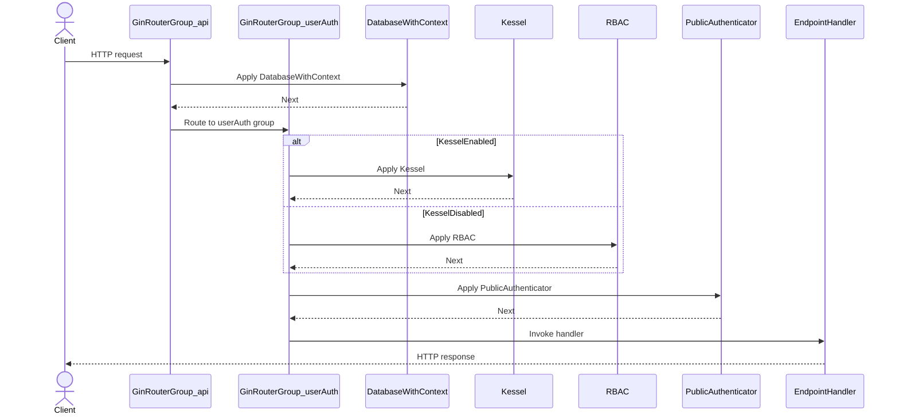
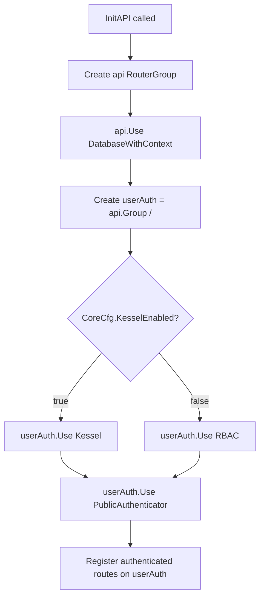

# Pull Request #2054: RHINENG-22821: fix rbac/kessel switch

**Author**: @Dugowitch
**Created**: February 12, 2026 at 10:01 AM UTC
**Status**: Merged
**Labels**: None
**Base**: `master` ← **Head**: `pr-1`

## Description

This is not expected to fix the issue from the ticket, I just noticed this bug during testing

## Secure Coding Practices Checklist GitHub Link
- https://github.com/RedHatInsights/secure-coding-checklist

## Secure Coding Checklist
- [x] Input Validation
- [x] Output Encoding
- [x] Authentication and Password Management
- [x] Session Management
- [x] Access Control
- [x] Cryptographic Practices
- [x] Error Handling and Logging
- [x] Data Protection
- [x] Communication Security
- [x] System Configuration
- [x] Database Security
- [x] File Management
- [x] Memory Management
- [x] General Coding Practices

## Summary by Sourcery

Enhancements:
- Adjust middleware selection so that RBAC is only applied when Kessel is disabled, avoiding conflicting access control handlers.

---

## Discussion

### Comment by @sourcery-ai on February 12, 2026 at 10:01 AM UTC

<!-- Generated by sourcery-ai[bot]: start review_guide -->

<details>
<summary>Reviewer's guide (collapsed on small PRs)</summary>

## Reviewer's Guide

Adjusts the authenticated routes middleware chain so that RBAC and Kessel are mutually exclusive, applying Kessel when enabled and RBAC otherwise to avoid conflicting access control handlers.

#### Sequence diagram for request handling with Kessel vs RBAC middleware



#### Flow diagram for InitAPI middleware selection between Kessel and RBAC



### File-Level Changes

| Change | Details | Files |
| ------ | ------- | ----- |
| Make RBAC and Kessel middlewares mutually exclusive on authenticated routes based on configuration. | <ul><li>Remove unconditional RBAC middleware from the authenticated routes group initialization.</li><li>Wrap middleware selection in a conditional: apply Kessel middleware when the Kessel feature flag is enabled.</li><li>Apply RBAC middleware only when the Kessel feature flag is disabled, ensuring only one access-control mechanism is active at a time.</li><li>Preserve the existing DatabaseWithContext and PublicAuthenticator middleware usage around the updated access-control logic.</li></ul> | `manager/routes/routes.go` |

</details>

---

<details>
<summary>Tips and commands</summary>

#### Interacting with Sourcery

- **Trigger a new review:** Comment `@sourcery-ai review` on the pull request.
- **Continue discussions:** Reply directly to Sourcery's review comments.
- **Generate a GitHub issue from a review comment:** Ask Sourcery to create an
  issue from a review comment by replying to it. You can also reply to a
  review comment with `@sourcery-ai issue` to create an issue from it.
- **Generate a pull request title:** Write `@sourcery-ai` anywhere in the pull
  request title to generate a title at any time. You can also comment
  `@sourcery-ai title` on the pull request to (re-)generate the title at any time.
- **Generate a pull request summary:** Write `@sourcery-ai summary` anywhere in
  the pull request body to generate a PR summary at any time exactly where you
  want it. You can also comment `@sourcery-ai summary` on the pull request to
  (re-)generate the summary at any time.
- **Generate reviewer's guide:** Comment `@sourcery-ai guide` on the pull
  request to (re-)generate the reviewer's guide at any time.
- **Resolve all Sourcery comments:** Comment `@sourcery-ai resolve` on the
  pull request to resolve all Sourcery comments. Useful if you've already
  addressed all the comments and don't want to see them anymore.
- **Dismiss all Sourcery reviews:** Comment `@sourcery-ai dismiss` on the pull
  request to dismiss all existing Sourcery reviews. Especially useful if you
  want to start fresh with a new review - don't forget to comment
  `@sourcery-ai review` to trigger a new review!

#### Customizing Your Experience

Access your [dashboard](https://app.sourcery.ai) to:
- Enable or disable review features such as the Sourcery-generated pull request
  summary, the reviewer's guide, and others.
- Change the review language.
- Add, remove or edit custom review instructions.
- Adjust other review settings.

#### Getting Help

- [Contact our support team](mailto:support@sourcery.ai) for questions or feedback.
- Visit our [documentation](https://docs.sourcery.ai) for detailed guides and information.
- Keep in touch with the Sourcery team by following us on [X/Twitter](https://x.com/SourceryAI), [LinkedIn](https://www.linkedin.com/company/sourcery-ai/) or [GitHub](https://github.com/sourcery-ai).

</details>

<!-- Generated by sourcery-ai[bot]: end review_guide -->

### Comment by @codecov-commenter on February 12, 2026 at 10:07 AM UTC

## [Codecov](https://app.codecov.io/gh/RedHatInsights/patchman-engine/pull/2054?dropdown=coverage&src=pr&el=h1&utm_medium=referral&utm_source=github&utm_content=comment&utm_campaign=pr+comments&utm_term=RedHatInsights) Report
:x: Patch coverage is `0%` with `2 lines` in your changes missing coverage. Please review.
:white_check_mark: Project coverage is 59.38%. Comparing base ([`ff33bf9`](https://app.codecov.io/gh/RedHatInsights/patchman-engine/commit/ff33bf9d2ee379a633c7f5bbe0fa48c42f0e564f?dropdown=coverage&el=desc&utm_medium=referral&utm_source=github&utm_content=comment&utm_campaign=pr+comments&utm_term=RedHatInsights)) to head ([`9f605a0`](https://app.codecov.io/gh/RedHatInsights/patchman-engine/commit/9f605a0c62fd7055f90e29b22c0b429d5e032c25?dropdown=coverage&el=desc&utm_medium=referral&utm_source=github&utm_content=comment&utm_campaign=pr+comments&utm_term=RedHatInsights)).

| [Files with missing lines](https://app.codecov.io/gh/RedHatInsights/patchman-engine/pull/2054?dropdown=coverage&src=pr&el=tree&utm_medium=referral&utm_source=github&utm_content=comment&utm_campaign=pr+comments&utm_term=RedHatInsights) | Patch % | Lines |
|---|---|---|
| [manager/routes/routes.go](https://app.codecov.io/gh/RedHatInsights/patchman-engine/pull/2054?src=pr&el=tree&filepath=manager%2Froutes%2Froutes.go&utm_medium=referral&utm_source=github&utm_content=comment&utm_campaign=pr+comments&utm_term=RedHatInsights#diff-bWFuYWdlci9yb3V0ZXMvcm91dGVzLmdv) | 0.00% | [2 Missing :warning: ](https://app.codecov.io/gh/RedHatInsights/patchman-engine/pull/2054?src=pr&el=tree&utm_medium=referral&utm_source=github&utm_content=comment&utm_campaign=pr+comments&utm_term=RedHatInsights) |

<details><summary>Additional details and impacted files</summary>


```diff
@@            Coverage Diff             @@
##           master    #2054      +/-   ##
==========================================
- Coverage   59.39%   59.38%   -0.01%     
==========================================
  Files         134      134              
  Lines        8678     8679       +1     
==========================================
  Hits         5154     5154              
- Misses       2977     2978       +1     
  Partials      547      547              
```

| [Flag](https://app.codecov.io/gh/RedHatInsights/patchman-engine/pull/2054/flags?src=pr&el=flags&utm_medium=referral&utm_source=github&utm_content=comment&utm_campaign=pr+comments&utm_term=RedHatInsights) | Coverage Δ | |
|---|---|---|
| [unittests](https://app.codecov.io/gh/RedHatInsights/patchman-engine/pull/2054/flags?src=pr&el=flag&utm_medium=referral&utm_source=github&utm_content=comment&utm_campaign=pr+comments&utm_term=RedHatInsights) | `59.38% <0.00%> (-0.01%)` | :arrow_down: |

Flags with carried forward coverage won't be shown. [Click here](https://docs.codecov.io/docs/carryforward-flags?utm_medium=referral&utm_source=github&utm_content=comment&utm_campaign=pr+comments&utm_term=RedHatInsights#carryforward-flags-in-the-pull-request-comment) to find out more.
</details>

[:umbrella: View full report in Codecov by Sentry](https://app.codecov.io/gh/RedHatInsights/patchman-engine/pull/2054?dropdown=coverage&src=pr&el=continue&utm_medium=referral&utm_source=github&utm_content=comment&utm_campaign=pr+comments&utm_term=RedHatInsights).   
:loudspeaker: Have feedback on the report? [Share it here](https://about.codecov.io/codecov-pr-comment-feedback/?utm_medium=referral&utm_source=github&utm_content=comment&utm_campaign=pr+comments&utm_term=RedHatInsights).
<details><summary> :rocket: New features to boost your workflow: </summary>

- :snowflake: [Test Analytics](https://docs.codecov.com/docs/test-analytics): Detect flaky tests, report on failures, and find test suite problems.
</details>

---

## Reviews

### Review by @sourcery-ai - Commented on February 12, 2026 at 02:47 PM UTC

Hey - I've left some high level feedback:

- Consider adding a brief code comment explaining that Kessel and RBAC middleware are mutually exclusive here so future changes don’t accidentally reintroduce both on the same route group.
- It may be clearer to construct the middleware slice conditionally (e.g., `authMiddlewares := []gin.HandlerFunc{}` then append either Kessel or RBAC) before applying it to the group, which can help avoid duplication if additional auth middlewares are added later.

<details>
<summary>Prompt for AI Agents</summary>

~~~markdown
Please address the comments from this code review:

## Overall Comments
- Consider adding a brief code comment explaining that Kessel and RBAC middleware are mutually exclusive here so future changes don’t accidentally reintroduce both on the same route group.
- It may be clearer to construct the middleware slice conditionally (e.g., `authMiddlewares := []gin.HandlerFunc{}` then append either Kessel or RBAC) before applying it to the group, which can help avoid duplication if additional auth middlewares are added later.
~~~

</details>

***

<details>
<summary>Sourcery is free for open source - if you like our reviews please consider sharing them ✨</summary>

- [X](https://twitter.com/intent/tweet?text=I%20just%20got%20an%20instant%20code%20review%20from%20%40SourceryAI%2C%20and%20it%20was%20brilliant%21%20It%27s%20free%20for%20open%20source%20and%20has%20a%20free%20trial%20for%20private%20code.%20Check%20it%20out%20https%3A//sourcery.ai)
- [Mastodon](https://mastodon.social/share?text=I%20just%20got%20an%20instant%20code%20review%20from%20%40SourceryAI%2C%20and%20it%20was%20brilliant%21%20It%27s%20free%20for%20open%20source%20and%20has%20a%20free%20trial%20for%20private%20code.%20Check%20it%20out%20https%3A//sourcery.ai)
- [LinkedIn](https://www.linkedin.com/sharing/share-offsite/?url=https://sourcery.ai)
- [Facebook](https://www.facebook.com/sharer/sharer.php?u=https://sourcery.ai)

</details>

<sub>
Help me be more useful! Please click 👍 or 👎 on each comment and I'll use the feedback to improve your reviews.
</sub>

### Review by @MichaelMraka - Approved on February 12, 2026 at 03:02 PM UTC

---

*Archived from: https://github.com/RedHatInsights/patchman-engine/pull/2054*
