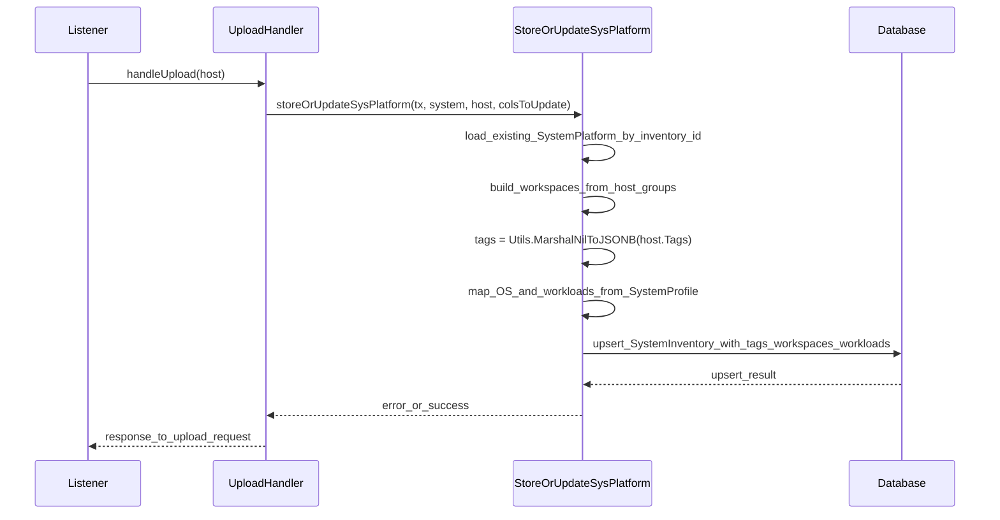
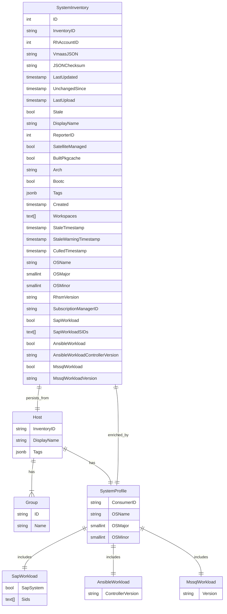
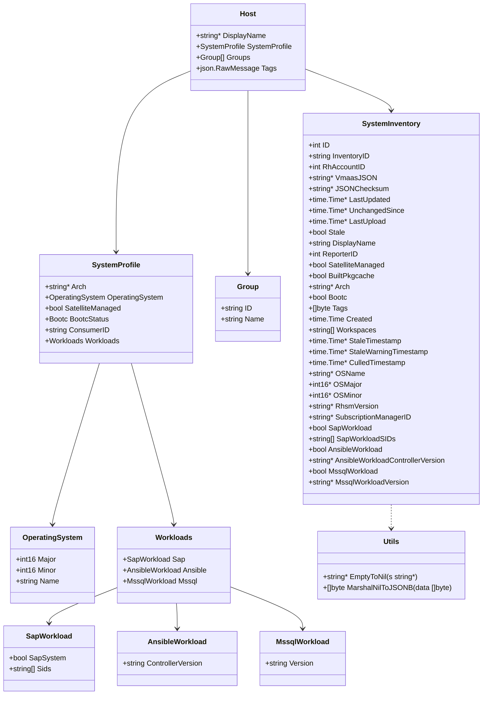

# Pull Request #2065: RHINENG-21443: store host attributes

**Author**: @TenSt
**Created**: February 16, 2026 at 08:59 PM UTC
**Status**: Merged
**Labels**: None
**Base**: `master` ← **Head**: `stepan/RHINENG-21443-store-host-attributes-in-new-tables`

## Description

This PR:
- updates `Host` struct with missing fields that will be processed
- adds missing fields to the `SystemInventory` table
- updates tests
- refactor: replaces regex-based “whitespace-only” checks with `strings.TrimSpace` for display name and template description

## Summary by Sourcery

Store additional host attributes from incoming inventory events and persist them to the SystemInventory model.

New Features:
- Capture host groups, tags, OS details, subscription identifiers, and workload attributes from inventory uploads and store them in SystemInventory.

Enhancements:
- Normalize whitespace-only checks for host display names and template descriptions using strings.TrimSpace instead of regex.
- Clarify SystemInventory timestamp and created-at fields as trigger-managed metadata, and ensure JSONB tag data is never null.

Tests:
- Extend upload and common tests to cover the new host attributes and updated persistence behavior.

---

## Discussion

### Comment by @sourcery-ai on February 16, 2026 at 08:59 PM UTC

<!-- Generated by sourcery-ai[bot]: start review_guide -->

## Reviewer's Guide

Extends host ingestion to persist tags, groups (workspaces), and workload-related system profile fields into SystemInventory, while refactoring some whitespace validation logic and updating tests accordingly.

#### Sequence diagram for storing host attributes into SystemInventory



#### ER diagram for updated SystemInventory persistence



#### Updated class diagram for host and inventory workload attributes



### File-Level Changes

| Change | Details | Files |
| ------ | ------- | ----- |
| Enrich Host model with groups, tags, and workload data from system profile and propagate these into SystemInventory persistence. | <ul><li>Added Groups and Tags fields to Host to capture inventory groups and raw tag payloads.</li><li>Extended inventory.SystemProfile with Workloads and defined Group, Workloads, SapWorkload, AnsibleWorkload, and MssqlWorkload types.</li><li>Updated storeOrUpdateSysPlatform signature to accept Host so it can map host-level tags, groups, OS, RHSM, and workload attributes into SystemInventory fields, including JSONB-safe tag handling with MarshalNilToJSONB and workspace derivation from groups.</li></ul> | `listener/upload.go`<br/>`base/inventory/inventory.go`<br/>`base/utils/openapi.go`<br/>`base/models/models.go` |
| Adjust SystemInventory schema annotations and default behaviors to align with database triggers and new JSON/array fields. | <ul><li>Clarified that LastUpdated, UnchangedSince, and Created are managed by database triggers via comments.</li><li>Ensured Tags remains a JSONB column and Workspaces a text[] column consistent with new tag/workspace persistence.</li></ul> | `base/models/models.go` |
| Refactor whitespace-only string checks to use strings.TrimSpace instead of regex for display names and template descriptions. | <ul><li>Removed spacesRegex and replaced its usage with TrimSpace checks when deciding whether to use Host.DisplayName.</li><li>Applied the same TrimSpace-based emptiness check to template description normalization.</li></ul> | `listener/upload.go`<br/>`listener/templates.go` |
| Update tests to exercise new Host attributes and SystemInventory mapping. | <ul><li>Extended createTestUploadEvent to populate DisplayName, Tags, Groups, OS, RHSM, and workload fields on Host.SystemProfile.</li><li>Updated storeOrUpdateSysPlatform tests to pass Host data into the function in line with the new signature and behavior.</li></ul> | `listener/common_test.go`<br/>`listener/upload_test.go` |

---

<details>
<summary>Tips and commands</summary>

#### Interacting with Sourcery

- **Trigger a new review:** Comment `@sourcery-ai review` on the pull request.
- **Continue discussions:** Reply directly to Sourcery's review comments.
- **Generate a GitHub issue from a review comment:** Ask Sourcery to create an
  issue from a review comment by replying to it. You can also reply to a
  review comment with `@sourcery-ai issue` to create an issue from it.
- **Generate a pull request title:** Write `@sourcery-ai` anywhere in the pull
  request title to generate a title at any time. You can also comment
  `@sourcery-ai title` on the pull request to (re-)generate the title at any time.
- **Generate a pull request summary:** Write `@sourcery-ai summary` anywhere in
  the pull request body to generate a PR summary at any time exactly where you
  want it. You can also comment `@sourcery-ai summary` on the pull request to
  (re-)generate the summary at any time.
- **Generate reviewer's guide:** Comment `@sourcery-ai guide` on the pull
  request to (re-)generate the reviewer's guide at any time.
- **Resolve all Sourcery comments:** Comment `@sourcery-ai resolve` on the
  pull request to resolve all Sourcery comments. Useful if you've already
  addressed all the comments and don't want to see them anymore.
- **Dismiss all Sourcery reviews:** Comment `@sourcery-ai dismiss` on the pull
  request to dismiss all existing Sourcery reviews. Especially useful if you
  want to start fresh with a new review - don't forget to comment
  `@sourcery-ai review` to trigger a new review!

#### Customizing Your Experience

Access your [dashboard](https://app.sourcery.ai) to:
- Enable or disable review features such as the Sourcery-generated pull request
  summary, the reviewer's guide, and others.
- Change the review language.
- Add, remove or edit custom review instructions.
- Adjust other review settings.

#### Getting Help

- [Contact our support team](mailto:support@sourcery.ai) for questions or feedback.
- Visit our [documentation](https://docs.sourcery.ai) for detailed guides and information.
- Keep in touch with the Sourcery team by following us on [X/Twitter](https://x.com/SourceryAI), [LinkedIn](https://www.linkedin.com/company/sourcery-ai/) or [GitHub](https://github.com/sourcery-ai).

</details>

<!-- Generated by sourcery-ai[bot]: end review_guide -->

### Comment by @github-actions on February 16, 2026 at 08:59 PM UTC

<!-- sc-environment-impact-check -->
## SC Environment Impact Assessment

**Overall Impact:** ⚪ **NONE**

No SC Environment-specific impacts detected in this PR.

<details>
<summary>What was checked</summary>

This PR was automatically scanned for:
- Database migrations
- ClowdApp configuration changes
- Kessel integration changes
- AWS service integrations (S3, RDS, ElastiCache)
- Kafka topic changes
- Secrets management changes
- External dependencies
</details>

### Comment by @codecov-commenter on February 16, 2026 at 09:05 PM UTC

## [Codecov](https://app.codecov.io/gh/RedHatInsights/patchman-engine/pull/2065?dropdown=coverage&src=pr&el=h1&utm_medium=referral&utm_source=github&utm_content=comment&utm_campaign=pr+comments&utm_term=RedHatInsights) Report
:x: Patch coverage is `88.09524%` with `5 lines` in your changes missing coverage. Please review.
:white_check_mark: Project coverage is 59.45%. Comparing base ([`ea4229a`](https://app.codecov.io/gh/RedHatInsights/patchman-engine/commit/ea4229a92883d64d6e9ed0dd5a928d8379240f5e?dropdown=coverage&el=desc&utm_medium=referral&utm_source=github&utm_content=comment&utm_campaign=pr+comments&utm_term=RedHatInsights)) to head ([`12e7cff`](https://app.codecov.io/gh/RedHatInsights/patchman-engine/commit/12e7cffd47c8a2ab65a868ca524e86714c40e546?dropdown=coverage&el=desc&utm_medium=referral&utm_source=github&utm_content=comment&utm_campaign=pr+comments&utm_term=RedHatInsights)).
:warning: Report is 4 commits behind head on master.

| [Files with missing lines](https://app.codecov.io/gh/RedHatInsights/patchman-engine/pull/2065?dropdown=coverage&src=pr&el=tree&utm_medium=referral&utm_source=github&utm_content=comment&utm_campaign=pr+comments&utm_term=RedHatInsights) | Patch % | Lines |
|---|---|---|
| [base/utils/openapi.go](https://app.codecov.io/gh/RedHatInsights/patchman-engine/pull/2065?src=pr&el=tree&filepath=base%2Futils%2Fopenapi.go&utm_medium=referral&utm_source=github&utm_content=comment&utm_campaign=pr+comments&utm_term=RedHatInsights#diff-YmFzZS91dGlscy9vcGVuYXBpLmdv) | 0.00% | [4 Missing :warning: ](https://app.codecov.io/gh/RedHatInsights/patchman-engine/pull/2065?src=pr&el=tree&utm_medium=referral&utm_source=github&utm_content=comment&utm_campaign=pr+comments&utm_term=RedHatInsights) |
| [listener/upload.go](https://app.codecov.io/gh/RedHatInsights/patchman-engine/pull/2065?src=pr&el=tree&filepath=listener%2Fupload.go&utm_medium=referral&utm_source=github&utm_content=comment&utm_campaign=pr+comments&utm_term=RedHatInsights#diff-bGlzdGVuZXIvdXBsb2FkLmdv) | 97.29% | [0 Missing and 1 partial :warning: ](https://app.codecov.io/gh/RedHatInsights/patchman-engine/pull/2065?src=pr&el=tree&utm_medium=referral&utm_source=github&utm_content=comment&utm_campaign=pr+comments&utm_term=RedHatInsights) |

<details><summary>Additional details and impacted files</summary>


```diff
@@            Coverage Diff             @@
##           master    #2065      +/-   ##
==========================================
+ Coverage   59.38%   59.45%   +0.07%     
==========================================
  Files         134      134              
  Lines        8679     8699      +20     
==========================================
+ Hits         5154     5172      +18     
- Misses       2978     2981       +3     
+ Partials      547      546       -1     
```

| [Flag](https://app.codecov.io/gh/RedHatInsights/patchman-engine/pull/2065/flags?src=pr&el=flags&utm_medium=referral&utm_source=github&utm_content=comment&utm_campaign=pr+comments&utm_term=RedHatInsights) | Coverage Δ | |
|---|---|---|
| [unittests](https://app.codecov.io/gh/RedHatInsights/patchman-engine/pull/2065/flags?src=pr&el=flag&utm_medium=referral&utm_source=github&utm_content=comment&utm_campaign=pr+comments&utm_term=RedHatInsights) | `59.45% <88.09%> (+0.07%)` | :arrow_up: |

Flags with carried forward coverage won't be shown. [Click here](https://docs.codecov.io/docs/carryforward-flags?utm_medium=referral&utm_source=github&utm_content=comment&utm_campaign=pr+comments&utm_term=RedHatInsights#carryforward-flags-in-the-pull-request-comment) to find out more.
</details>

[:umbrella: View full report in Codecov by Sentry](https://app.codecov.io/gh/RedHatInsights/patchman-engine/pull/2065?dropdown=coverage&src=pr&el=continue&utm_medium=referral&utm_source=github&utm_content=comment&utm_campaign=pr+comments&utm_term=RedHatInsights).   
:loudspeaker: Have feedback on the report? [Share it here](https://about.codecov.io/codecov-pr-comment-feedback/?utm_medium=referral&utm_source=github&utm_content=comment&utm_campaign=pr+comments&utm_term=RedHatInsights).
<details><summary> :rocket: New features to boost your workflow: </summary>

- :snowflake: [Test Analytics](https://docs.codecov.com/docs/test-analytics): Detect flaky tests, report on failures, and find test suite problems.
</details>

### Comment by @MichaelMraka on February 17, 2026 at 09:45 AM UTC

Can you please split it into smaller logical parts so it's easier to review? 
Ideally one commit per "issue", e.g.
- one for whitespace checks refactor (this is nice catch BTW),
- one for Host struct update
- and one for table update.

### Comment by @patchkez on February 17, 2026 at 11:54 AM UTC

/retest

---

## Reviews

### Review by @sourcery-ai - Commented on February 16, 2026 at 09:01 PM UTC

Hey - I've found 2 issues, and left some high level feedback:

- In `storeOrUpdateSysPlatform`, `workspaces := make([]string, len(host.Groups))` followed by `append` will produce a slice with `len(host.Groups)` empty strings plus the appended IDs; either initialize with `make([]string, 0, len(host.Groups))` or assign by index instead of appending.
- The new `MarshalNilToJSONB` helper only treats zero-length input as "nil"; if `host.Tags` ever contains the literal JSON `null`, it will be stored as `null` in a NOT NULL JSONB column instead of an empty array—if the intent is to normalize both cases to `[]`, consider detecting and normalizing `"null"` as well.

<details>
<summary>Prompt for AI Agents</summary>

~~~markdown
Please address the comments from this code review:

## Overall Comments
- In `storeOrUpdateSysPlatform`, `workspaces := make([]string, len(host.Groups))` followed by `append` will produce a slice with `len(host.Groups)` empty strings plus the appended IDs; either initialize with `make([]string, 0, len(host.Groups))` or assign by index instead of appending.
- The new `MarshalNilToJSONB` helper only treats zero-length input as "nil"; if `host.Tags` ever contains the literal JSON `null`, it will be stored as `null` in a NOT NULL JSONB column instead of an empty array—if the intent is to normalize both cases to `[]`, consider detecting and normalizing `"null"` as well.

## Individual Comments

### Comment 1
<location> `listener/upload.go:432-436` </location>
<code_context>
 		},
 	})

+	workspaces := make([]string, len(host.Groups))
+	for _, group := range host.Groups {
+		workspaces = append(workspaces, group.ID)
+	}
+	slices.Sort(workspaces)
+
 	inventoryRecord := models.SystemInventory{
</code_context>

<issue_to_address>
**issue (bug_risk):** Fix workspace slice construction to avoid leading empty elements

This pattern creates a slice with `len(host.Groups)` empty strings, then appends one ID per group, resulting in twice the expected length and leading empty entries. Instead, either:

- `workspaces := make([]string, 0, len(host.Groups))` and keep using `append`, or
- keep `make([]string, len(host.Groups))` and assign by index: `for i, group := range host.Groups { workspaces[i] = group.ID }`.

Otherwise `Workspaces` will contain empty values and can break queries relying on this field.
</issue_to_address>

### Comment 2
<location> `listener/upload_test.go:369-370` </location>
<code_context>
 	}
 	// insert new row
-	err := storeOrUpdateSysPlatform(database.DB, &inStore, colsToUpdate)
+	hostEvent := createTestUploadEvent("1", id, "puptoo", false, true, "created")
+	err := storeOrUpdateSysPlatform(database.DB, &inStore, &hostEvent.Host, colsToUpdate)
 	assert.Nil(t, err)

</code_context>

<issue_to_address>
**suggestion (testing):** Extend `TestStoreOrUpdateSysPlatform` to assert that the new inventory fields derived from `Host` are persisted correctly.

Since `storeOrUpdateSysPlatform` now populates `SystemInventory` from additional `Host` fields, this test only verifies the legacy `SystemPlatform` columns. Please extend it (or add a new test) to read the `SystemInventory` row and assert that:

- `Tags` matches the JSON from `hostEvent.Host.Tags`.
- `Workspaces` contains `hostEvent.Host.Groups` IDs in sorted order.
- `OSName`, `OSMajor`, `OSMinor` match `hostEvent.Host.SystemProfile.OperatingSystem`.
- `RhsmVersion`, `SubscriptionManagerID` are taken from `SystemProfile`.
- All workload flags/versions (`SapWorkload`, `SapWorkloadSIDs`, `AnsibleWorkload*`, `MssqlWorkload*`) match `hostEvent.Host.SystemProfile.Workloads`.

This will verify the new fields are persisted and updated correctly.

Suggested implementation:

```golang
		SatelliteManaged: false,
	}
	// insert new row
	hostEvent := createTestUploadEvent("1", id, "puptoo", false, true, "created")
	err := storeOrUpdateSysPlatform(database.DB, &inStore, &hostEvent.Host, colsToUpdate)
	assert.Nil(t, err)

	// verify SystemPlatform was created
	var outStore models.SystemPlatform
	err = database.DB.Where("id = ?", inStore.ID).First(&outStore).Error
	assert.Nil(t, err)

	// verify SystemInventory was created from Host fields
	var inventoryAfterInsert models.SystemInventory
	err = database.DB.Where("id = ?", inStore.ID).First(&inventoryAfterInsert).Error
	assert.Nil(t, err)

	// Tags should match Host.Tags JSON
	tagsJSON, err := json.Marshal(hostEvent.Host.Tags)
	assert.Nil(t, err)
	assert.Equal(t, string(tagsJSON), inventoryAfterInsert.Tags)

	// Workspaces should contain Host.Groups IDs in sorted order
	var expectedWorkspaces []string
	for _, g := range hostEvent.Host.Groups {
		expectedWorkspaces = append(expectedWorkspaces, g.ID)
	}
	sort.Strings(expectedWorkspaces)
	assert.Equal(t, expectedWorkspaces, inventoryAfterInsert.Workspaces)

	// OS fields should match SystemProfile.OperatingSystem
	if hostEvent.Host.SystemProfile != nil && hostEvent.Host.SystemProfile.OperatingSystem != nil {
		assert.Equal(t, hostEvent.Host.SystemProfile.OperatingSystem.Name, inventoryAfterInsert.OSName)
		assert.Equal(t, hostEvent.Host.SystemProfile.OperatingSystem.Major, inventoryAfterInsert.OSMajor)
		assert.Equal(t, hostEvent.Host.SystemProfile.OperatingSystem.Minor, inventoryAfterInsert.OSMinor)
	}

	// RHSM and subscription manager fields
	if hostEvent.Host.SystemProfile != nil {
		assert.Equal(t, hostEvent.Host.SystemProfile.RhsmVersion, inventoryAfterInsert.RhsmVersion)
		assert.Equal(t, hostEvent.Host.SystemProfile.SubscriptionManagerID, inventoryAfterInsert.SubscriptionManagerID)
	}

	// Workload fields should match SystemProfile.Workloads
	if hostEvent.Host.SystemProfile != nil && hostEvent.Host.SystemProfile.Workloads != nil {
		assert.Equal(t, hostEvent.Host.SystemProfile.Workloads.SapWorkload, inventoryAfterInsert.SapWorkload)
		assert.ElementsMatch(t, hostEvent.Host.SystemProfile.Workloads.SapWorkloadSIDs, inventoryAfterInsert.SapWorkloadSIDs)

		assert.Equal(t, hostEvent.Host.SystemProfile.Workloads.AnsibleWorkload, inventoryAfterInsert.AnsibleWorkload)
		assert.Equal(t, hostEvent.Host.SystemProfile.Workloads.AnsibleWorkloadControllerVersion, inventoryAfterInsert.AnsibleWorkloadControllerVersion)
		assert.Equal(t, hostEvent.Host.SystemProfile.Workloads.AnsibleWorkloadHubVersion, inventoryAfterInsert.AnsibleWorkloadHubVersion)

		assert.Equal(t, hostEvent.Host.SystemProfile.Workloads.MssqlWorkload, inventoryAfterInsert.MssqlWorkload)
		assert.Equal(t, hostEvent.Host.SystemProfile.Workloads.MssqlWorkloadVersion, inventoryAfterInsert.MssqlWorkloadVersion)
	}

	// prepare update payload
	inUpdate.SatelliteManaged = true

	// update row
	err = storeOrUpdateSysPlatform(database.DB, &inUpdate, &hostEvent.Host, colsToUpdate)
	assert.Nil(t, err)

	// verify SystemPlatform was updated
	var outUpdate models.SystemPlatform
	err = database.DB.Where("id = ?", inUpdate.ID).First(&outUpdate).Error
	assert.Nil(t, err)

	// verify SystemInventory is still in sync with Host after update
	var inventoryAfterUpdate models.SystemInventory
	err = database.DB.Where("id = ?", inUpdate.ID).First(&inventoryAfterUpdate).Error
	assert.Nil(t, err)

	assert.Equal(t, string(tagsJSON), inventoryAfterUpdate.Tags)
	assert.Equal(t, expectedWorkspaces, inventoryAfterUpdate.Workspaces)

	if hostEvent.Host.SystemProfile != nil && hostEvent.Host.SystemProfile.OperatingSystem != nil {
		assert.Equal(t, hostEvent.Host.SystemProfile.OperatingSystem.Name, inventoryAfterUpdate.OSName)
		assert.Equal(t, hostEvent.Host.SystemProfile.OperatingSystem.Major, inventoryAfterUpdate.OSMajor)
		assert.Equal(t, hostEvent.Host.SystemProfile.OperatingSystem.Minor, inventoryAfterUpdate.OSMinor)
	}

	if hostEvent.Host.SystemProfile != nil {
		assert.Equal(t, hostEvent.Host.SystemProfile.RhsmVersion, inventoryAfterUpdate.RhsmVersion)
		assert.Equal(t, hostEvent.Host.SystemProfile.SubscriptionManagerID, inventoryAfterUpdate.SubscriptionManagerID)
	}

	if hostEvent.Host.SystemProfile != nil && hostEvent.Host.SystemProfile.Workloads != nil {
		assert.Equal(t, hostEvent.Host.SystemProfile.Workloads.SapWorkload, inventoryAfterUpdate.SapWorkload)
		assert.ElementsMatch(t, hostEvent.Host.SystemProfile.Workloads.SapWorkloadSIDs, inventoryAfterUpdate.SapWorkloadSIDs)

		assert.Equal(t, hostEvent.Host.SystemProfile.Workloads.AnsibleWorkload, inventoryAfterUpdate.AnsibleWorkload)
		assert.Equal(t, hostEvent.Host.SystemProfile.Workloads.AnsibleWorkloadControllerVersion, inventoryAfterUpdate.AnsibleWorkloadControllerVersion)
		assert.Equal(t, hostEvent.Host.SystemProfile.Workloads.AnsibleWorkloadHubVersion, inventoryAfterUpdate.AnsibleWorkloadHubVersion)

		assert.Equal(t, hostEvent.Host.SystemProfile.Workloads.MssqlWorkload, inventoryAfterUpdate.MssqlWorkload)
		assert.Equal(t, hostEvent.Host.SystemProfile.Workloads.MssqlWorkloadVersion, inventoryAfterUpdate.MssqlWorkloadVersion)
	}

```

1. Ensure `listener/upload_test.go` imports the packages used above if they are not already imported:
   - `encoding/json` (for `json.Marshal`)
   - `sort` (for `sort.Strings`)
2. The code assumes:
   - There is a `models.SystemInventory` struct mapped to the same primary key (`id`) as `models.SystemPlatform`. If the relation is via a different foreign key (e.g. `inventory_id`), adjust the `Where("id = ?", …)` lookups accordingly.
   - `models.SystemInventory` has the fields:
     - `Tags` (string or `[]byte` holding JSON), `Workspaces` (`[]string`), `OSName`, `OSMajor`, `OSMinor`,
       `RhsmVersion`, `SubscriptionManagerID`,
       `SapWorkload`, `SapWorkloadSIDs` (`[]string`),
       `AnsibleWorkload`, `AnsibleWorkloadControllerVersion`, `AnsibleWorkloadHubVersion`,
       `MssqlWorkload`, `MssqlWorkloadVersion`.
     If the actual field names or types differ, update the assertions to match your model.
   - `hostEvent.Host` has a `SystemProfile` field with nested `OperatingSystem`, `RhsmVersion`, `SubscriptionManagerID`, and `Workloads` fields as referenced. If your actual `SystemProfile`/`Workloads` shapes differ, wire the assertions to the correct properties (e.g. `SystemProfile.Rhsm.Version`, `SystemProfile.Sap.Workload`, etc.).
3. If `Tags` in `SystemInventory` is stored as a JSONB/array type instead of a raw JSON string, adjust the comparison to either:
   - Unmarshal `inventoryAfterInsert.Tags` and compare structs/slices, or
   - Use whatever helper is already used elsewhere in your tests to compare tag sets.
4. If you want to explicitly test that updates *change* the inventory fields, you can create a second `hostEventUpdated := createTestUploadEvent(...)` with different tags/workloads and pass `&hostEventUpdated.Host` into the second `storeOrUpdateSysPlatform` call, then update the `expected*` values and assertions to reflect the updated host.
</issue_to_address>
~~~

</details>

***

<details>
<summary>Sourcery is free for open source - if you like our reviews please consider sharing them ✨</summary>

- [X](https://twitter.com/intent/tweet?text=I%20just%20got%20an%20instant%20code%20review%20from%20%40SourceryAI%2C%20and%20it%20was%20brilliant%21%20It%27s%20free%20for%20open%20source%20and%20has%20a%20free%20trial%20for%20private%20code.%20Check%20it%20out%20https%3A//sourcery.ai)
- [Mastodon](https://mastodon.social/share?text=I%20just%20got%20an%20instant%20code%20review%20from%20%40SourceryAI%2C%20and%20it%20was%20brilliant%21%20It%27s%20free%20for%20open%20source%20and%20has%20a%20free%20trial%20for%20private%20code.%20Check%20it%20out%20https%3A//sourcery.ai)
- [LinkedIn](https://www.linkedin.com/sharing/share-offsite/?url=https://sourcery.ai)
- [Facebook](https://www.facebook.com/sharer/sharer.php?u=https://sourcery.ai)

</details>

<sub>
Help me be more useful! Please click 👍 or 👎 on each comment and I'll use the feedback to improve your reviews.
</sub>

### Review by @MichaelMraka - Commented on February 17, 2026 at 09:24 AM UTC

### Review by @TenSt - Commented on February 17, 2026 at 11:07 AM UTC

### Review by @MichaelMraka - Approved on February 17, 2026 at 01:17 PM UTC

---

*Archived from: https://github.com/RedHatInsights/patchman-engine/pull/2065*
